# Nipuna CRM — API Execution Flows

Function-to-function and file-to-file flowcharts of the shared request pipeline and the step 1 endpoints (health, auth, users, roles, branches, staff).

> **Scope.** Only the endpoints listed below are drawn. Every later module (see [API_PLAN.md](API_PLAN.md)) follows the same route → controller → service → repository → model path, and the same auth (section 2), error and transaction (section 3) pipelines shown here.

- Base prefix for every path: **`/api/v1`** (`API_PREFIX`, [backend/config/settings.py:26](../backend/config/settings.py#L26))
- Diagrams are Mermaid. They render on GitHub and in VS Code with a Mermaid preview extension.
- In each diagram, a **box with a file name** holds the functions from that file. An arrow is a call or the next step. **Red** nodes are error responses and **green** nodes are successful responses. **Grey dashed** nodes are shared flows drawn in full in another section.

---

## Contents

1. [File map (layers)](#file-map)
2. [Shared: authentication pipeline (`@login_required`, `@require_roles`, `@fresh_auth`)](#auth-pipeline)
3. [Shared: response, error and transaction pipeline](#response-pipeline)
4. [Shared sub-flow: `services/users.py · _grant()`](#grant-subflow)
5. Endpoints

| # | Method | Path | Guards |
|---|---|---|---|
| 5.1 | GET | [`/health`](#health) | Public |
| 5.2 | POST | [`/auth/login`](#auth-login) | Public |
| 5.3 | POST | [`/auth/logout`](#auth-logout) | Logged in |
| 5.4 | GET | [`/auth/me`](#auth-me) | Logged in |
| 5.5 | POST | [`/auth/reauthenticate`](#auth-reauthenticate) | Logged in |
| 5.6 | POST | [`/auth/change-password`](#auth-change-password) | Logged in |
| 5.7 | GET | [`/auth/sessions`](#auth-sessions) | Logged in |
| 5.8 | DELETE | [`/auth/sessions/<session_id>`](#auth-revoke-session) | Logged in |
| 5.9 | GET | [`/users`](#users-list) | Admin |
| 5.10 | POST | [`/users`](#users-create) | Admin + fresh auth |
| 5.11 | GET | [`/users/<user_id>`](#users-get) | Admin |
| 5.12 | PATCH | [`/users/<user_id>`](#users-update) | Admin |
| 5.13 | POST | [`/users/<user_id>/reset-password`](#users-reset-password) | Admin + fresh auth |
| 5.14 | GET | [`/users/<user_id>/scopes`](#users-scopes-list) | Admin |
| 5.15 | POST | [`/users/<user_id>/scopes`](#users-scopes-grant) | Admin + fresh auth |
| 5.16 | DELETE | [`/users/<user_id>/scopes/<scope_id>`](#users-scopes-revoke) | Admin + fresh auth |
| 5.17 | GET | [`/roles`](#roles) | Logged in |
| 5.18 | GET | [`/branches`](#branches) | Logged in |
| 5.19 | GET | [`/branches/<branch_id>`](#branches-get) | Logged in |
| 5.20 | PATCH | [`/branches/<branch_id>`](#branches-update) | Admin |
| 5.21 | GET | [`/staff`](#staff) | Logged in |

"Admin" means the user holds `FOUNDER_CEO` or `SUPER_ADMIN` (`ADMIN_ROLES`, [backend/services/context.py:9](../backend/services/context.py#L9)). The other branch endpoints in [routes/masters.py](../backend/routes/masters.py) (`/branches/<id>/shifts`, `/holidays`) belong to step 2 and use the same pipeline.

---

## 1. File map (layers)

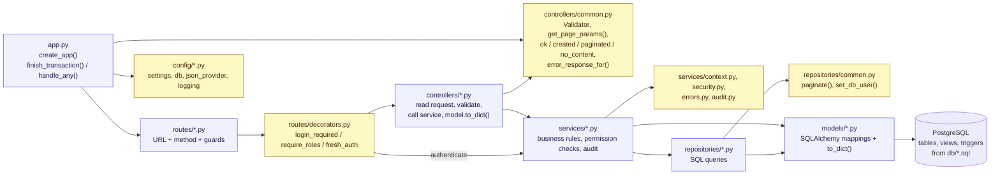
```mermaid
flowchart LR
    classDef layer fill:#eef2ff,stroke:#4f46e5,color:#1e1b4b
    classDef shared fill:#fef9c3,stroke:#a16207,color:#422006

    APP["app.py<br/>create_app()<br/>finish_transaction() / handle_any()"]:::layer
    ROUTES["routes/*.py<br/>URL + method + guards"]:::layer
    GUARDS["routes/decorators.py<br/>login_required / require_roles / fresh_auth"]:::shared
    CTRL["controllers/*.py<br/>read request, validate,<br/>call service, model.to_dict()"]:::layer
    CCOM["controllers/common.py<br/>Validator, get_page_params(),<br/>ok / created / paginated / no_content,<br/>error_response_for()"]:::shared
    SVC["services/*.py<br/>business rules, permission checks, audit"]:::layer
    SCOM["services/context.py, security.py,<br/>errors.py, audit.py"]:::shared
    REPO["repositories/*.py<br/>SQL queries"]:::layer
    RCOM["repositories/common.py<br/>paginate(), set_db_user()"]:::shared
    MODEL["models/*.py<br/>SQLAlchemy mappings + to_dict()"]:::layer
    CONF["config/*.py<br/>settings, db, json_provider, logging"]:::shared
    DB[("PostgreSQL<br/>tables, views, triggers<br/>from db/*.sql")]

    APP --> ROUTES --> GUARDS --> CTRL
    GUARDS -->|authenticate| SVC
    CTRL --> CCOM
    CTRL --> SVC
    SVC --> SCOM
    SVC --> REPO --> MODEL --> DB
    SVC --> MODEL
    REPO --> RCOM
    APP --> CCOM
    APP --> CONF
```

| Layer | Files |
|---|---|
| Entry | [backend/app.py](../backend/app.py), [backend/routes/\_\_init\_\_.py](../backend/routes/__init__.py) |
| Routes | [auth.py](../backend/routes/auth.py), [users.py](../backend/routes/users.py), [reference.py](../backend/routes/reference.py), [masters.py](../backend/routes/masters.py), [health.py](../backend/routes/health.py), [decorators.py](../backend/routes/decorators.py) |
| Controllers | [auth.py](../backend/controllers/auth.py), [users.py](../backend/controllers/users.py), [reference.py](../backend/controllers/reference.py), [masters.py](../backend/controllers/masters.py), [health.py](../backend/controllers/health.py), [common.py](../backend/controllers/common.py) |
| Services | [auth.py](../backend/services/auth.py), [users.py](../backend/services/users.py), [reference.py](../backend/services/reference.py), [branches.py](../backend/services/branches.py), [health.py](../backend/services/health.py), [audit.py](../backend/services/audit.py), [context.py](../backend/services/context.py), [security.py](../backend/services/security.py), [errors.py](../backend/services/errors.py) |
| Repositories | [users.py](../backend/repositories/users.py), [sessions.py](../backend/repositories/sessions.py), [settings.py](../backend/repositories/settings.py), [common.py](../backend/repositories/common.py) |
| Models | [access.py](../backend/models/access.py) (Role, User, UserRoleScope, UserSession, ActiveSession), [masters.py](../backend/models/masters.py) (Branch), [system.py](../backend/models/system.py) (AuditLog, AppSetting) |
| Config | [settings.py](../backend/config/settings.py), [database.py](../backend/config/database.py), [json_provider.py](../backend/config/json_provider.py), [logging.py](../backend/config/logging.py) |

At startup, `create_app()` ([backend/app.py:18](../backend/app.py#L18)) wires everything once: `get_config` → `configure_logging` → `app.json = JSONProvider(app)` → `db.init_app` → `register_transaction_hook` (after-request commit / rollback, [:34](../backend/app.py#L34)) → `register_error_handlers` ([:50](../backend/app.py#L50)) → `register_blueprints` (adds the `/api/v1` prefix, [routes/\_\_init\_\_.py:41](../backend/routes/__init__.py#L41)) → `register_cli`.

---

## 2. Shared: authentication pipeline

Every endpoint except `/health` and `/auth/login` runs this **before** its route function. The decorators always run in this order: `@login_required` → `@require_roles(...)` (admin routes only) → `@fresh_auth` (sensitive routes only) → the view.

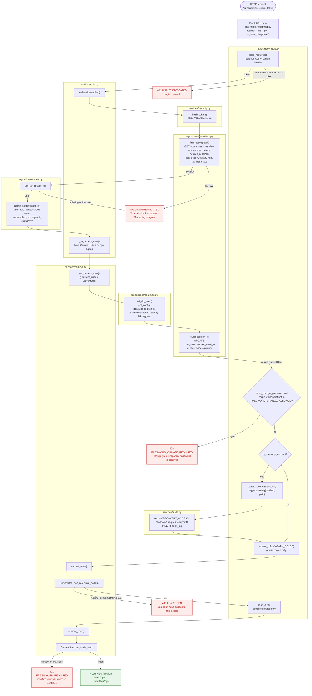
```mermaid
flowchart TD
    classDef err fill:#fdecea,stroke:#c62828,color:#b71c1c
    classDef done fill:#e8f5e9,stroke:#2e7d32,color:#1b5e20

    REQ(["HTTP request<br/>Authorization: Bearer token"])
    URL["Flask URL map<br/>blueprints registered by<br/>routes/__init__.py · register_blueprints()"]

    subgraph sgGuard["routes/decorators.py"]
        LR["login_required()<br/>partition Authorization header"]
        PCR{"must_change_password and<br/>request.endpoint not in<br/>PASSWORD_CHANGE_ALLOWED?"}
        REC{"is_recovery_account?"}
        ARA["_audit_recovery_access()<br/>logger.warning(method, path)"]
        RR["require_roles(*ADMIN_ROLES)<br/>admin routes only"]
        FA["fresh_auth()<br/>sensitive routes only"]
    end

    subgraph sgSvc["services/auth.py"]
        AUTH["authenticate(token)"]
        TCU["_to_current_user()<br/>build CurrentUser + Scope tuples"]
    end

    subgraph sgSec["services/security.py"]
        HT["hash_token()<br/>SHA-256 of the token"]
    end

    subgraph sgSess["repositories/sessions.py"]
        FIND["find_active(hash)<br/>GET active_sessions view:<br/>not revoked, before expires_at (12 h),<br/>last_seen within 30 min, has_fresh_auth"]
        TOUCH["touch(session_id)<br/>UPDATE user_sessions.last_seen_at<br/>at most once a minute"]
    end

    subgraph sgUsers["repositories/users.py"]
        GBI["get_by_id(user_id)"]
        ASC["active_scopes(user_id)<br/>user_role_scopes JOIN roles<br/>not revoked, not expired, role active"]
    end

    subgraph sgCtx["services/context.py"]
        SCU["set_current_user()<br/>g.current_user = CurrentUser"]
        CU1["current_user()"]
        HR["CurrentUser.has_role(*role_codes)"]
        CU2["current_user()"]
        HFA["CurrentUser.has_fresh_auth"]
    end

    subgraph sgDbc["repositories/common.py"]
        SDU["set_db_user()<br/>set_config app.current_user_id,<br/>transaction-local, read by DB triggers"]
    end

    subgraph sgAudit["services/audit.py"]
        AR["record('RECOVERY_ACCESS',<br/>'endpoint', request.endpoint)<br/>INSERT audit_log"]
    end

    VIEW["Route view function<br/>routes/*.py → controllers/*.py"]:::done

    E401A["401 UNAUTHENTICATED<br/>Login required"]:::err
    E401B["401 UNAUTHENTICATED<br/>Your session has expired.<br/>Please log in again."]:::err
    E403P["403 PASSWORD_CHANGE_REQUIRED<br/>Change your temporary password to continue"]:::err
    E403F["403 FORBIDDEN<br/>You don't have access to this action"]:::err
    E401F["401 FRESH_AUTH_REQUIRED<br/>Confirm your password to continue"]:::err

    REQ --> URL --> LR
    LR -->|scheme not bearer or no token| E401A
    LR -->|token| AUTH
    AUTH --> HT --> FIND
    FIND -->|no row| E401B
    FIND -->|session| GBI
    GBI -->|missing or inactive| E401B
    GBI -->|user| ASC --> TCU --> SCU --> SDU --> TOUCH
    TOUCH -->|return CurrentUser| PCR
    PCR -->|yes| E403P
    PCR -->|no| REC
    REC -->|yes| ARA --> AR --> RR
    REC -->|no| RR
    RR --> CU1 --> HR
    HR -->|no user or no matching role| E403F
    HR -->|ok| FA
    FA --> CU2 --> HFA
    HFA -->|no user or not fresh| E401F
    HFA -->|fresh| VIEW
```

- `PASSWORD_CHANGE_ALLOWED = {"auth.me", "auth.logout", "auth.change_password"}` ([routes/decorators.py:18](../backend/routes/decorators.py#L18)). A user with a temporary password can call only those three endpoints; everything else returns 403 `PASSWORD_CHANGE_REQUIRED`.
- **Idle / max session / fresh auth** are enforced in SQL, not Python. The max session length comes from `trg_user_sessions_expiry`, which sets `expires_at = created_at + session_max_hours` (default 12) on insert ([db/010_prototype_alignment.sql:138](../db/010_prototype_alignment.sql#L138)). The `active_sessions` view ([db/010_prototype_alignment.sql:142](../db/010_prototype_alignment.sql#L142)) drops rows that are revoked, past `expires_at` or idle longer than `session_idle_minutes` (default 30), and computes `has_fresh_auth` as `reauthenticated_at` within `fresh_auth_minutes` (default 15).
- **Recovery accounts:** every request is logged with `logger.warning` and writes a `RECOVERY_ACCESS` audit row **before** the role / fresh-auth checks. The audit row is part of the request transaction, so if the request then fails (status 400 or above) the row is rolled back by `finish_transaction()`; only the log line survives.

**Call trace**

| # | Location | Function | What it does |
|---|---|---|---|
| 1 | [routes/decorators.py:21](../backend/routes/decorators.py#L21) | `login_required` | Reads `Authorization`. Anything other than `Bearer <token>` (case-insensitive scheme) → 401 |
| 2 | [services/auth.py:33](../backend/services/auth.py#L33) | `authenticate` | Resolves the token to the current user |
| 3 | [services/security.py:38](../backend/services/security.py#L38) | `hash_token` | SHA-256. Only the hash is stored |
| 4 | [repositories/sessions.py:15](../backend/repositories/sessions.py#L15) | `find_active` | `db.session.get(ActiveSession, ...)` on the `active_sessions` view |
| 5 | [repositories/users.py:16](../backend/repositories/users.py#L16) | `get_by_id` | Missing or inactive user → 401 |
| 6 | [repositories/users.py:31](../backend/repositories/users.py#L31) | `active_scopes` | Role scopes that are live now (`_active_scope_condition`, [:9](../backend/repositories/users.py#L9)) |
| 7 | [services/auth.py:50](../backend/services/auth.py#L50) | `_to_current_user` | Builds the frozen `CurrentUser` dataclass ([services/context.py:32](../backend/services/context.py#L32)) |
| 8 | [services/context.py:72](../backend/services/context.py#L72) | `set_current_user` | Stores it on `flask.g` |
| 9 | [repositories/common.py:13](../backend/repositories/common.py#L13) | `set_db_user` | `set_config('app.current_user_id', ..., true)` for triggers |
| 10 | [repositories/sessions.py:29](../backend/repositories/sessions.py#L29) | `touch` | Updates `last_seen_at` (at most once a minute) |
| 11 | [routes/decorators.py:29](../backend/routes/decorators.py#L29) | `login_required` | Forced password change check |
| 12 | [routes/decorators.py:38](../backend/routes/decorators.py#L38) → [services/audit.py:17](../backend/services/audit.py#L17) | `_audit_recovery_access` → `record` | Recovery accounts: every request is audited |
| 13 | [routes/decorators.py:45](../backend/routes/decorators.py#L45) | `require_roles` | Any matching role at any branch, via [services/context.py:50](../backend/services/context.py#L50) `has_role`. Branch-level checks happen in services |
| 14 | [routes/decorators.py:61](../backend/routes/decorators.py#L61) | `fresh_auth` | Needs `has_fresh_auth` from the session view |

---

## 3. Shared: response, error and transaction pipeline

Every endpoint **finishes** through this. One DB transaction covers the whole request.

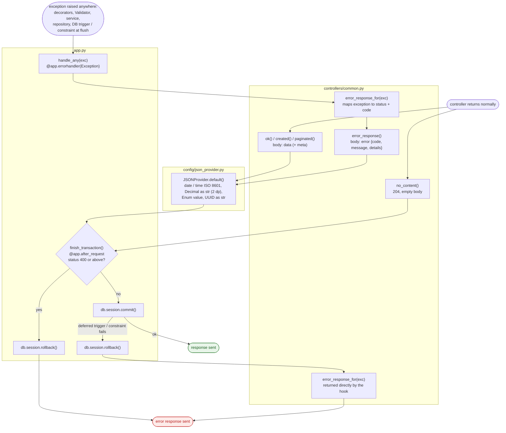
```mermaid
flowchart TD
    classDef err fill:#fdecea,stroke:#c62828,color:#b71c1c
    classDef done fill:#e8f5e9,stroke:#2e7d32,color:#1b5e20

    CTRL(["controller returns normally"])
    EXC(["exception raised anywhere:<br/>decorators, Validator, service,<br/>repository, DB trigger / constraint at flush"])

    subgraph sgResp["controllers/common.py"]
        OK["ok() / created() / paginated()<br/>body: data (+ meta)"]
        NC["no_content()<br/>204, empty body"]
        ERF["error_response_for(exc)<br/>maps exception to status + code"]
        ERR["error_response()<br/>body: error {code, message, details}"]
        ERF2["error_response_for(exc)<br/>returned directly by the hook"]
    end

    subgraph sgJson["config/json_provider.py"]
        JP["JSONProvider.default()<br/>date / time ISO 8601, Decimal as str (2 dp),<br/>Enum value, UUID as str"]
    end

    subgraph sgApp["app.py"]
        HA["handle_any(exc)<br/>@app.errorhandler(Exception)"]
        FT{"finish_transaction()<br/>@app.after_request<br/>status 400 or above?"}
        CM["db.session.commit()"]
        RB1["db.session.rollback()"]
        RB2["db.session.rollback()"]
    end

    SENT(["response sent"]):::done
    FAIL(["error response sent"]):::err

    CTRL --> OK --> JP --> FT
    CTRL --> NC --> FT
    EXC --> HA --> ERF --> ERR --> JP
    FT -->|yes| RB1 --> FAIL
    FT -->|no| CM
    CM -->|ok| SENT
    CM -->|deferred trigger / constraint fails| RB2 --> ERF2 --> FAIL
```

**How `error_response_for` maps exceptions** ([controllers/common.py:337](../backend/controllers/common.py#L337), Postgres table `PG_ERRORS` at [:326](../backend/controllers/common.py#L326))

| Exception | Status | `code` | `message` / `details` |
|---|---|---|---|
| `AppError` subclasses ([services/errors.py](../backend/services/errors.py)): `ValidationError` 400, `Unauthenticated` 401, `FreshAuthRequired` 401, `Forbidden` 403, `PasswordChangeRequired` 403, `NotFound` 404, `Conflict` 409, `BusinessRule` 422, `TooManyAttempts` 429 | its own | its own | its own |
| `ValidationError` from `Validator.validate()` | 400 | `VALIDATION_ERROR` | `Invalid request data`, field messages in `details` |
| werkzeug `HTTPException` (for example a non-integer `<int:user_id>` → 404, wrong method → 405) | its own | name upper-cased, e.g. `NOT_FOUND`, `METHOD_NOT_ALLOWED` | werkzeug description |
| `DBAPIError`, SQLSTATE `P0001` trigger `RAISE`, `23514` check, `23P01` exclusion, `23502` not null | 422 | `BUSINESS_RULE` | Postgres primary message; `details.constraint` / `details.detail` when present |
| `DBAPIError`, SQLSTATE `23503` foreign key | 422 | `INVALID_REFERENCE` | as above |
| `DBAPIError`, SQLSTATE `23505` unique | 409 | `CONFLICT` | as above |
| `DBAPIError`, SQLSTATE `22P02` bad text / enum | 400 | `VALIDATION_ERROR` | as above |
| Anything else (incl. other SQLSTATEs) | 500 | `INTERNAL_ERROR` | `Something went wrong` (logged with `logger.exception`) |

**Request input helpers** (all in [controllers/common.py](../backend/controllers/common.py)): `json_body()` ([:52](../backend/controllers/common.py#L52)) returns `{}` for a missing or non-object body, so missing fields surface as `Required`; `Validator` ([:61](../backend/controllers/common.py#L61)) keeps only fields present in the input (or with a default), with `string`, `email` (trimmed, lower-cased, max 255), `integer`, `boolean`, `datetime` (ISO 8601 with offset), `list_of` and others; `get_page_params()` ([:307](../backend/controllers/common.py#L307)) reads `page` (default 1, min 1) and `per_page` (default 25, max 100) and raises `Invalid pagination parameters`.

---

## 4. Shared sub-flow: `services/users.py · _grant()`

Used by **POST `/users`** (once per scope in the request), **POST `/users/<id>/scopes`** and the `flask create-admin` CLI. Source: [backend/services/users.py:135](../backend/services/users.py#L135).

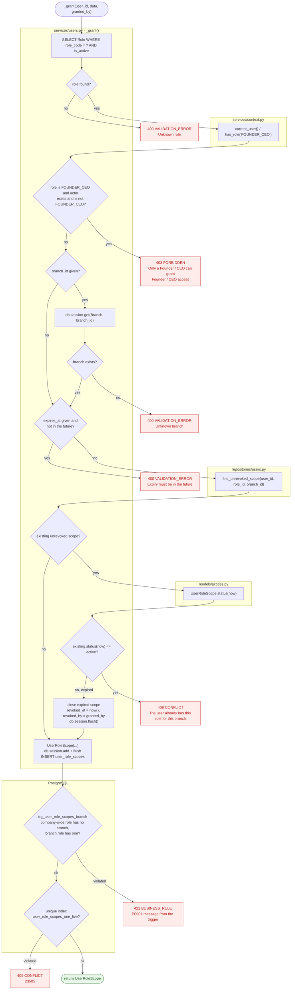
```mermaid
flowchart TD
    classDef err fill:#fdecea,stroke:#c62828,color:#b71c1c
    classDef done fill:#e8f5e9,stroke:#2e7d32,color:#1b5e20

    IN(["_grant(user_id, data, granted_by)"])

    subgraph sgSvc["services/users.py · _grant()"]
        G1["SELECT Role WHERE role_code = ? AND is_active"]
        G2{"role found?"}
        G3{"role is FOUNDER_CEO and actor<br/>exists and is not FOUNDER_CEO?"}
        G4{"branch_id given?"}
        G5["db.session.get(Branch, branch_id)"]
        G6{"branch exists?"}
        G7{"expires_at given and<br/>not in the future?"}
        G9{"existing unrevoked scope?"}
        G10{"existing.status(now) == active?"}
        G11["close expired scope<br/>revoked_at = now(), revoked_by = granted_by<br/>db.session.flush()"]
        G12["UserRoleScope(...)<br/>db.session.add + flush<br/>INSERT user_role_scopes"]
    end

    subgraph sgCtx["services/context.py"]
        CU["current_user() / has_role('FOUNDER_CEO')"]
    end

    subgraph sgRepo["repositories/users.py"]
        G8["find_unrevoked_scope(user_id, role_id, branch_id)"]
    end

    subgraph sgModel["models/access.py"]
        ST["UserRoleScope.status(now)"]
    end

    subgraph sgDb["PostgreSQL"]
        TRG{"trg_user_role_scopes_branch<br/>company-wide role has no branch,<br/>branch role has one?"}
        UQ{"unique index<br/>user_role_scopes_one_live?"}
    end

    E400R["400 VALIDATION_ERROR<br/>Unknown role"]:::err
    E403["403 FORBIDDEN<br/>Only a Founder / CEO can grant<br/>Founder / CEO access"]:::err
    E400B["400 VALIDATION_ERROR<br/>Unknown branch"]:::err
    E400E["400 VALIDATION_ERROR<br/>Expiry must be in the future"]:::err
    E409["409 CONFLICT<br/>The user already has this role for this branch"]:::err
    E422["422 BUSINESS_RULE<br/>P0001 message from the trigger"]:::err
    E409U["409 CONFLICT<br/>23505"]:::err
    OUT(["return UserRoleScope"]):::done

    IN --> G1 --> G2
    G2 -->|no| E400R
    G2 -->|yes| CU --> G3
    G3 -->|yes| E403
    G3 -->|no| G4
    G4 -->|yes| G5 --> G6
    G6 -->|no| E400B
    G6 -->|yes| G7
    G4 -->|no| G7
    G7 -->|yes| E400E
    G7 -->|no| G8 --> G9
    G9 -->|yes| ST --> G10
    G10 -->|yes| E409
    G10 -->|no, expired| G11 --> G12
    G9 -->|no| G12
    G12 --> TRG
    TRG -->|violated| E422
    TRG -->|ok| UQ
    UQ -->|violated| E409U
    UQ -->|ok| OUT
```

| # | Location | What |
|---|---|---|
| 1 | [repositories/users.py:52](../backend/repositories/users.py#L52) | `find_unrevoked_scope` — the (user, role, branch) slot, active or expired |
| 2 | [models/access.py:100](../backend/models/access.py#L100) | `UserRoleScope.status` — `revoked` / `expired` / `active` |
| 3 | [db/010_prototype_alignment.sql:84](../db/010_prototype_alignment.sql#L84) | `trg_user_role_scopes_branch` |
| 4 | [db/010_prototype_alignment.sql:65](../db/010_prototype_alignment.sql#L65) | `user_role_scopes_one_live` unique index |

---

## 5. Endpoints

### 5.1 GET `/api/v1/health`

Public. Checks that the app is up and that it can reach the database.

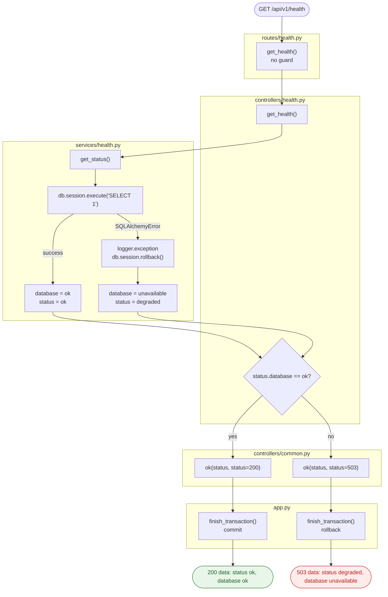
```mermaid
flowchart TD
    classDef err fill:#fdecea,stroke:#c62828,color:#b71c1c
    classDef done fill:#e8f5e9,stroke:#2e7d32,color:#1b5e20

    REQ(["GET /api/v1/health"])

    subgraph sgR["routes/health.py"]
        R1["get_health()<br/>no guard"]
    end
    subgraph sgC["controllers/health.py"]
        C1["get_health()"]
        C2{"status.database == ok?"}
    end
    subgraph sgS["services/health.py"]
        S1["get_status()"]
        S2["db.session.execute('SELECT 1')"]
        S3["logger.exception<br/>db.session.rollback()"]
        D1["database = ok<br/>status = ok"]
        D2["database = unavailable<br/>status = degraded"]
    end
    subgraph sgResp["controllers/common.py"]
        OK1["ok(status, status=200)"]
        OK2["ok(status, status=503)"]
    end
    subgraph sgTx["app.py"]
        FT1["finish_transaction()<br/>commit"]
        FT2["finish_transaction()<br/>rollback"]
    end

    RES1(["200 data: status ok, database ok"]):::done
    RES2(["503 data: status degraded, database unavailable"]):::err

    REQ --> R1 --> C1 --> S1 --> S2
    S2 -->|success| D1 --> C2
    S2 -->|SQLAlchemyError| S3 --> D2 --> C2
    C2 -->|yes| OK1 --> FT1 --> RES1
    C2 -->|no| OK2 --> FT2 --> RES2
```

| # | Location | Function |
|---|---|---|
| 1 | [routes/health.py:9](../backend/routes/health.py#L9) | `get_health` |
| 2 | [controllers/health.py:5](../backend/controllers/health.py#L5) | `get_health` |
| 3 | [services/health.py:12](../backend/services/health.py#L12) | `get_status` |
| 4 | [controllers/common.py:24](../backend/controllers/common.py#L24) | `ok` |

---

### 5.2 POST `/api/v1/auth/login`

Public. Body: `{email, password}`. Returns a token plus the same profile that `/auth/me` returns.

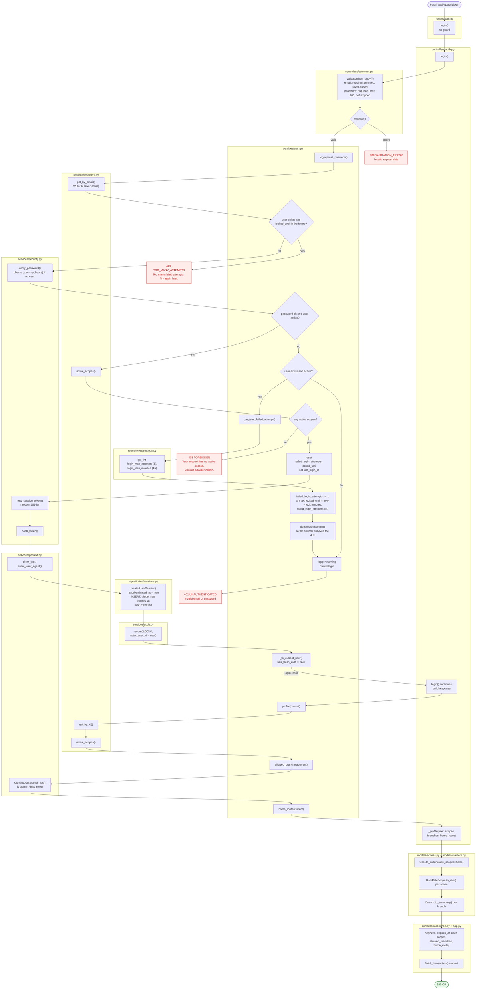
```mermaid
flowchart TD
    classDef err fill:#fdecea,stroke:#c62828,color:#b71c1c
    classDef done fill:#e8f5e9,stroke:#2e7d32,color:#1b5e20

    REQ(["POST /api/v1/auth/login"])

    subgraph sgR["routes/auth.py"]
        R1["login()<br/>no guard"]
    end
    subgraph sgC["controllers/auth.py"]
        C1["login()"]
        C2["login() continues<br/>build response"]
        C3["_profile(user, scopes,<br/>branches, home_route)"]
    end
    subgraph sgV["controllers/common.py"]
        V1["Validator(json_body())<br/>email: required, trimmed, lower-cased<br/>password: required, max 200, not stripped"]
        V2{"validate()"}
    end
    subgraph sgS["services/auth.py"]
        S1["login(email, password)"]
        S2{"user exists and<br/>locked_until in the future?"}
        S3{"password ok and user active?"}
        S3b{"user exists and active?"}
        S4["_register_failed_attempt()"]
        S4b["failed_login_attempts += 1<br/>at max: locked_until = now + lock minutes,<br/>failed_login_attempts = 0"]
        S4c["db.session.commit()<br/>so the counter survives the 401"]
        LOGW["logger.warning<br/>Failed login"]
        S5{"any active scopes?"}
        S6["reset failed_login_attempts, locked_until<br/>set last_login_at"]
        S7["_to_current_user()<br/>has_fresh_auth = True"]
        S8["profile(current)"]
        S9["allowed_branches(current)"]
        S10["home_route(current)"]
    end
    subgraph sgU["repositories/users.py"]
        U1["get_by_email()<br/>WHERE lower(email)"]
        U2["active_scopes()"]
        U3["get_by_id()"]
        U4["active_scopes()"]
    end
    subgraph sgSet["repositories/settings.py"]
        ST["get_int login_max_attempts (5),<br/>login_lock_minutes (15)"]
    end
    subgraph sgSec["services/security.py"]
        P1["verify_password()<br/>checks _dummy_hash() if no user"]
        P2["new_session_token()<br/>random 256-bit"]
        P3["hash_token()"]
    end
    subgraph sgCtx["services/context.py"]
        X1["client_ip() / client_user_agent()"]
        X2["CurrentUser.branch_ids()<br/>is_admin / has_role()"]
    end
    subgraph sgSess["repositories/sessions.py"]
        SS1["create(UserSession)<br/>reauthenticated_at = now<br/>INSERT, trigger sets expires_at<br/>flush + refresh"]
    end
    subgraph sgA["services/audit.py"]
        A1["record('LOGIN',<br/>actor_user_id = user)"]
    end
    subgraph sgM["models/access.py + models/masters.py"]
        D1["User.to_dict(include_scopes=False)"]
        D2["UserRoleScope.to_dict() per scope"]
        D3["Branch.to_summary() per branch"]
    end
    subgraph sgResp["controllers/common.py + app.py"]
        OK["ok(token, expires_at, user, scopes,<br/>allowed_branches, home_route)"]
        FT["finish_transaction() commit"]
    end

    E400["400 VALIDATION_ERROR<br/>Invalid request data"]:::err
    E429["429 TOO_MANY_ATTEMPTS<br/>Too many failed attempts. Try again later."]:::err
    E401["401 UNAUTHENTICATED<br/>Invalid email or password"]:::err
    E403["403 FORBIDDEN<br/>Your account has no active access.<br/>Contact a Super Admin."]:::err
    RES(["200 OK"]):::done

    REQ --> R1 --> C1 --> V1 --> V2
    V2 -->|errors| E400
    V2 -->|valid| S1 --> U1 --> S2
    S2 -->|yes| E429
    S2 -->|no| P1 --> S3
    S3 -->|no| S3b
    S3b -->|yes| S4 --> ST --> S4b --> S4c --> LOGW
    S3b -->|no| LOGW
    LOGW --> E401
    S3 -->|yes| U2 --> S5
    S5 -->|no| E403
    S5 -->|yes| S6 --> P2 --> P3 --> X1 --> SS1 --> A1 --> S7
    S7 -->|LoginResult| C2
    C2 --> S8 --> U3 --> U4 --> S9 --> X2 --> S10
    S10 --> C3 --> D1 --> D2 --> D3 --> OK --> FT --> RES
```

| # | Location | Function |
|---|---|---|
| 1 | [routes/auth.py:10](../backend/routes/auth.py#L10) | `login` |
| 2 | [controllers/auth.py:15](../backend/controllers/auth.py#L15) | `login` (Validator rules) |
| 3 | [services/auth.py:67](../backend/services/auth.py#L67) | `login` |
| 4 | [repositories/users.py:20](../backend/repositories/users.py#L20) | `get_by_email` |
| 5 | [services/security.py:19](../backend/services/security.py#L19) | `verify_password` (constant-time for unknown emails) |
| 6 | [services/auth.py:102](../backend/services/auth.py#L102) → [repositories/settings.py:15](../backend/repositories/settings.py#L15) | `_register_failed_attempt` → `get_int` |
| 7 | [repositories/users.py:31](../backend/repositories/users.py#L31) | `active_scopes` |
| 8 | [services/security.py:33](../backend/services/security.py#L33), [:38](../backend/services/security.py#L38) | `new_session_token`, `hash_token` |
| 9 | [repositories/sessions.py:8](../backend/repositories/sessions.py#L8) | `create` |
| 10 | [services/audit.py:17](../backend/services/audit.py#L17) | `record("LOGIN")`. The actor is passed explicitly because no user is in context yet |
| 11 | [services/auth.py:123](../backend/services/auth.py#L123), [:131](../backend/services/auth.py#L131), [:139](../backend/services/auth.py#L139) | `profile`, `allowed_branches`, `home_route` |
| 12 | [controllers/auth.py:6](../backend/controllers/auth.py#L6) | `_profile` → [User.to_dict](../backend/models/access.py#L61), [UserRoleScope.to_dict](../backend/models/access.py#L107), [Branch.to_summary](../backend/models/masters.py#L38) |

---

### 5.3 POST `/api/v1/auth/logout`

Logged in (allowed during a forced password change). Revokes the current session.

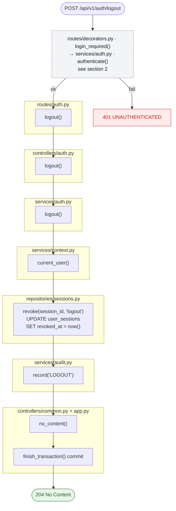
```mermaid
flowchart TD
    classDef err fill:#fdecea,stroke:#c62828,color:#b71c1c
    classDef done fill:#e8f5e9,stroke:#2e7d32,color:#1b5e20
    classDef shared fill:#f3f4f6,stroke:#6b7280,stroke-dasharray:4 3,color:#111827

    REQ(["POST /api/v1/auth/logout"])
    LR["routes/decorators.py · login_required()<br/>→ services/auth.py · authenticate()<br/>see section 2"]:::shared

    subgraph sgR["routes/auth.py"]
        R1["logout()"]
    end
    subgraph sgC["controllers/auth.py"]
        C1["logout()"]
    end
    subgraph sgS["services/auth.py"]
        S1["logout()"]
    end
    subgraph sgCtx["services/context.py"]
        X1["current_user()"]
    end
    subgraph sgSess["repositories/sessions.py"]
        SS1["revoke(session_id, 'logout')<br/>UPDATE user_sessions<br/>SET revoked_at = now()"]
    end
    subgraph sgA["services/audit.py"]
        A1["record('LOGOUT')"]
    end
    subgraph sgResp["controllers/common.py + app.py"]
        NC["no_content()"]
        FT["finish_transaction() commit"]
    end

    E401["401 UNAUTHENTICATED"]:::err
    RES(["204 No Content"]):::done

    REQ --> LR
    LR -->|fail| E401
    LR -->|ok| R1 --> C1 --> S1 --> X1 --> SS1 --> A1 --> NC --> FT --> RES
```

| # | Location | Function |
|---|---|---|
| 1 | [routes/auth.py:16](../backend/routes/auth.py#L16) | `logout` |
| 2 | [controllers/auth.py:26](../backend/controllers/auth.py#L26) | `logout` |
| 3 | [services/auth.py:115](../backend/services/auth.py#L115) | `logout` |
| 4 | [repositories/sessions.py:44](../backend/repositories/sessions.py#L44) | `revoke` |
| 5 | [services/audit.py:17](../backend/services/audit.py#L17) | `record` |

---

### 5.4 GET `/api/v1/auth/me`

Logged in (allowed during a forced password change). Returns the user, active scopes, allowed branches and landing route.

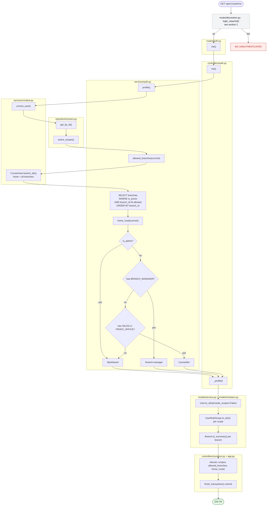
```mermaid
flowchart TD
    classDef err fill:#fdecea,stroke:#c62828,color:#b71c1c
    classDef done fill:#e8f5e9,stroke:#2e7d32,color:#1b5e20
    classDef shared fill:#f3f4f6,stroke:#6b7280,stroke-dasharray:4 3,color:#111827

    REQ(["GET /api/v1/auth/me"])
    LR["routes/decorators.py · login_required()<br/>see section 2"]:::shared

    subgraph sgR["routes/auth.py"]
        R1["me()"]
    end
    subgraph sgC["controllers/auth.py"]
        C1["me()"]
        C2["_profile()"]
    end
    subgraph sgS["services/auth.py"]
        S1["profile()"]
        S2["allowed_branches(current)"]
        S3["SELECT branches<br/>WHERE is_active<br/>AND branch_id IN allowed<br/>ORDER BY branch_id"]
        S4["home_route(current)"]
        H1{"is_admin?"}
        H2{"has BRANCH_MANAGER?"}
        H3{"has SALES or FRONT_OFFICE?"}
        HR1["/dashboard"]
        HR2["/branch-manager"]
        HR3["/counsellor"]
    end
    subgraph sgCtx["services/context.py"]
        X1["current_user()"]
        X2["CurrentUser.branch_ids()<br/>None = all branches"]
    end
    subgraph sgU["repositories/users.py"]
        U1["get_by_id()"]
        U2["active_scopes()"]
    end
    subgraph sgM["models/access.py + models/masters.py"]
        D1["User.to_dict(include_scopes=False)"]
        D2["UserRoleScope.to_dict() per scope"]
        D3["Branch.to_summary() per branch"]
    end
    subgraph sgResp["controllers/common.py + app.py"]
        OK["ok(user, scopes, allowed_branches, home_route)"]
        FT["finish_transaction() commit"]
    end

    E401["401 UNAUTHENTICATED"]:::err
    RES(["200 OK"]):::done

    REQ --> LR
    LR -->|fail| E401
    LR -->|ok| R1 --> C1 --> S1 --> X1 --> U1 --> U2 --> S2 --> X2 --> S3 --> S4 --> H1
    H1 -->|yes| HR1
    H1 -->|no| H2
    H2 -->|yes| HR2
    H2 -->|no| H3
    H3 -->|yes| HR3
    H3 -->|no| HR1
    HR1 & HR2 & HR3 --> C2 --> D1 --> D2 --> D3 --> OK --> FT --> RES
```

| # | Location | Function |
|---|---|---|
| 1 | [routes/auth.py:22](../backend/routes/auth.py#L22) | `me` |
| 2 | [controllers/auth.py:31](../backend/controllers/auth.py#L31) | `me` |
| 3 | [services/auth.py:123](../backend/services/auth.py#L123) | `profile` |
| 4 | [services/auth.py:131](../backend/services/auth.py#L131) → [services/context.py:57](../backend/services/context.py#L57) | `allowed_branches` → `branch_ids` |
| 5 | [services/auth.py:139](../backend/services/auth.py#L139) | `home_route` |
| 6 | [controllers/auth.py:6](../backend/controllers/auth.py#L6) | `_profile` |

---

### 5.5 POST `/api/v1/auth/reauthenticate`

Logged in. Body: `{password}`. Refreshes `reauthenticated_at` so that `@fresh_auth` routes pass for the next `fresh_auth_minutes` (15). This endpoint is **not** in `PASSWORD_CHANGE_ALLOWED`, so a user with a temporary password gets 403.

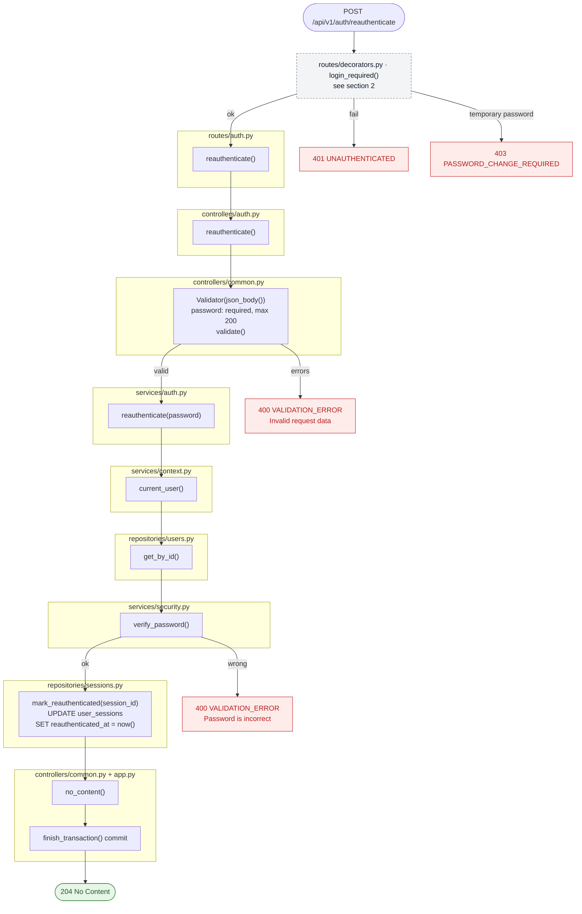
```mermaid
flowchart TD
    classDef err fill:#fdecea,stroke:#c62828,color:#b71c1c
    classDef done fill:#e8f5e9,stroke:#2e7d32,color:#1b5e20
    classDef shared fill:#f3f4f6,stroke:#6b7280,stroke-dasharray:4 3,color:#111827

    REQ(["POST /api/v1/auth/reauthenticate"])
    LR["routes/decorators.py · login_required()<br/>see section 2"]:::shared

    subgraph sgR["routes/auth.py"]
        R1["reauthenticate()"]
    end
    subgraph sgC["controllers/auth.py"]
        C1["reauthenticate()"]
    end
    subgraph sgV["controllers/common.py"]
        V1["Validator(json_body())<br/>password: required, max 200<br/>validate()"]
    end
    subgraph sgS["services/auth.py"]
        S1["reauthenticate(password)"]
    end
    subgraph sgCtx["services/context.py"]
        X1["current_user()"]
    end
    subgraph sgU["repositories/users.py"]
        U1["get_by_id()"]
    end
    subgraph sgSec["services/security.py"]
        P1["verify_password()"]
    end
    subgraph sgSess["repositories/sessions.py"]
        SS1["mark_reauthenticated(session_id)<br/>UPDATE user_sessions<br/>SET reauthenticated_at = now()"]
    end
    subgraph sgResp["controllers/common.py + app.py"]
        NC["no_content()"]
        FT["finish_transaction() commit"]
    end

    E401["401 UNAUTHENTICATED"]:::err
    E403["403 PASSWORD_CHANGE_REQUIRED"]:::err
    E400V["400 VALIDATION_ERROR<br/>Invalid request data"]:::err
    E400P["400 VALIDATION_ERROR<br/>Password is incorrect"]:::err
    RES(["204 No Content"]):::done

    REQ --> LR
    LR -->|fail| E401
    LR -->|temporary password| E403
    LR -->|ok| R1 --> C1 --> V1
    V1 -->|errors| E400V
    V1 -->|valid| S1 --> X1 --> U1 --> P1
    P1 -->|wrong| E400P
    P1 -->|ok| SS1 --> NC --> FT --> RES
```

| # | Location | Function |
|---|---|---|
| 1 | [routes/auth.py:28](../backend/routes/auth.py#L28) | `reauthenticate` |
| 2 | [controllers/auth.py:35](../backend/controllers/auth.py#L35) | `reauthenticate` (Validator rules) |
| 3 | [services/auth.py:152](../backend/services/auth.py#L152) | `reauthenticate` |
| 4 | [repositories/sessions.py:38](../backend/repositories/sessions.py#L38) | `mark_reauthenticated` |

---

### 5.6 POST `/api/v1/auth/change-password`

Logged in (allowed during a forced password change). Body: `{current_password, new_password}`. Signs out every other session.

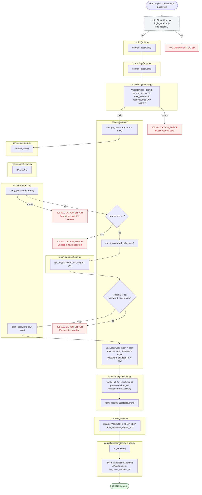
```mermaid
flowchart TD
    classDef err fill:#fdecea,stroke:#c62828,color:#b71c1c
    classDef done fill:#e8f5e9,stroke:#2e7d32,color:#1b5e20
    classDef shared fill:#f3f4f6,stroke:#6b7280,stroke-dasharray:4 3,color:#111827

    REQ(["POST /api/v1/auth/change-password"])
    LR["routes/decorators.py · login_required()<br/>see section 2"]:::shared

    subgraph sgR["routes/auth.py"]
        R1["change_password()"]
    end
    subgraph sgC["controllers/auth.py"]
        C1["change_password()"]
    end
    subgraph sgV["controllers/common.py"]
        V1["Validator(json_body())<br/>current_password, new_password:<br/>required, max 200<br/>validate()"]
    end
    subgraph sgS["services/auth.py"]
        S1["change_password(current, new)"]
        S2{"new == current?"}
        S3["check_password_policy(new)"]
        S4{"length at least<br/>password_min_length?"}
        S5["user.password_hash = hash<br/>must_change_password = False<br/>password_changed_at = now"]
    end
    subgraph sgCtx["services/context.py"]
        X1["current_user()"]
    end
    subgraph sgU["repositories/users.py"]
        U1["get_by_id()"]
    end
    subgraph sgSec["services/security.py"]
        P1["verify_password(current)"]
        P2["hash_password(new)<br/>scrypt"]
    end
    subgraph sgSet["repositories/settings.py"]
        ST["get_int('password_min_length', 10)"]
    end
    subgraph sgSess["repositories/sessions.py"]
        SS1["revoke_all_for_user(user_id,<br/>'password changed',<br/>except current session)"]
        SS2["mark_reauthenticated(current)"]
    end
    subgraph sgA["services/audit.py"]
        A1["record('PASSWORD_CHANGED',<br/>other_sessions_signed_out)"]
    end
    subgraph sgResp["controllers/common.py + app.py"]
        NC["no_content()"]
        FT["finish_transaction() commit<br/>UPDATE users, trg_users_updated_at"]
    end

    E401["401 UNAUTHENTICATED"]:::err
    E400V["400 VALIDATION_ERROR<br/>Invalid request data"]:::err
    E400C["400 VALIDATION_ERROR<br/>Current password is incorrect"]:::err
    E400S["400 VALIDATION_ERROR<br/>Choose a new password"]:::err
    E400L["400 VALIDATION_ERROR<br/>Password is too short"]:::err
    RES(["204 No Content"]):::done

    REQ --> LR
    LR -->|fail| E401
    LR -->|ok| R1 --> C1 --> V1
    V1 -->|errors| E400V
    V1 -->|valid| S1 --> X1 --> U1 --> P1
    P1 -->|wrong| E400C
    P1 -->|ok| S2
    S2 -->|yes| E400S
    S2 -->|no| S3 --> ST --> S4
    S4 -->|no| E400L
    S4 -->|yes| P2 --> S5 --> SS1 --> SS2 --> A1 --> NC --> FT --> RES
```

| # | Location | Function |
|---|---|---|
| 1 | [routes/auth.py:34](../backend/routes/auth.py#L34) | `change_password` |
| 2 | [controllers/auth.py:42](../backend/controllers/auth.py#L42) | `change_password` (Validator rules) |
| 3 | [services/auth.py:166](../backend/services/auth.py#L166) | `change_password` |
| 4 | [services/auth.py:160](../backend/services/auth.py#L160) | `check_password_policy` |
| 5 | [services/security.py:15](../backend/services/security.py#L15) | `hash_password` |
| 6 | [repositories/sessions.py:52](../backend/repositories/sessions.py#L52), [:38](../backend/repositories/sessions.py#L38) | `revoke_all_for_user`, `mark_reauthenticated` |
| 7 | [db/002_phase0_foundation.sql:102](../db/002_phase0_foundation.sql#L102) | `trg_users_updated_at` |

---

### 5.7 GET `/api/v1/auth/sessions`

Logged in. Lists the caller's own active sessions and marks the current one.

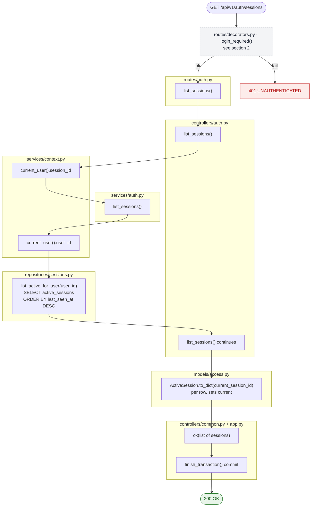
```mermaid
flowchart TD
    classDef err fill:#fdecea,stroke:#c62828,color:#b71c1c
    classDef done fill:#e8f5e9,stroke:#2e7d32,color:#1b5e20
    classDef shared fill:#f3f4f6,stroke:#6b7280,stroke-dasharray:4 3,color:#111827

    REQ(["GET /api/v1/auth/sessions"])
    LR["routes/decorators.py · login_required()<br/>see section 2"]:::shared

    subgraph sgR["routes/auth.py"]
        R1["list_sessions()"]
    end
    subgraph sgC["controllers/auth.py"]
        C1["list_sessions()"]
        C2["list_sessions() continues"]
    end
    subgraph sgS["services/auth.py"]
        S1["list_sessions()"]
    end
    subgraph sgCtx["services/context.py"]
        X2["current_user().session_id"]
        X1["current_user().user_id"]
    end
    subgraph sgSess["repositories/sessions.py"]
        SS1["list_active_for_user(user_id)<br/>SELECT active_sessions<br/>ORDER BY last_seen_at DESC"]
    end
    subgraph sgM["models/access.py"]
        D1["ActiveSession.to_dict(current_session_id)<br/>per row, sets current"]
    end
    subgraph sgResp["controllers/common.py + app.py"]
        OK["ok(list of sessions)"]
        FT["finish_transaction() commit"]
    end

    E401["401 UNAUTHENTICATED"]:::err
    RES(["200 OK"]):::done

    REQ --> LR
    LR -->|fail| E401
    LR -->|ok| R1 --> C1 --> X2 --> S1 --> X1 --> SS1 --> C2 --> D1 --> OK --> FT --> RES
```

| # | Location | Function |
|---|---|---|
| 1 | [routes/auth.py:40](../backend/routes/auth.py#L40) | `list_sessions` |
| 2 | [controllers/auth.py:52](../backend/controllers/auth.py#L52) | `list_sessions` |
| 3 | [services/auth.py:185](../backend/services/auth.py#L185) | `list_sessions` |
| 4 | [repositories/sessions.py:24](../backend/repositories/sessions.py#L24) | `list_active_for_user` |
| 5 | [models/access.py:158](../backend/models/access.py#L158) | `ActiveSession.to_dict` |

---

### 5.8 DELETE `/api/v1/auth/sessions/<session_id>`

Logged in. `session_id` is the hashed id returned by `GET /auth/sessions`. Only the caller's own sessions can be revoked.

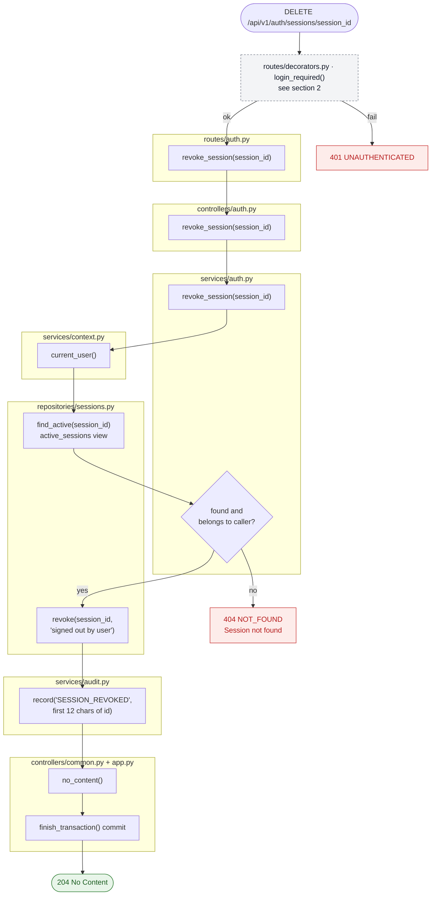
```mermaid
flowchart TD
    classDef err fill:#fdecea,stroke:#c62828,color:#b71c1c
    classDef done fill:#e8f5e9,stroke:#2e7d32,color:#1b5e20
    classDef shared fill:#f3f4f6,stroke:#6b7280,stroke-dasharray:4 3,color:#111827

    REQ(["DELETE /api/v1/auth/sessions/session_id"])
    LR["routes/decorators.py · login_required()<br/>see section 2"]:::shared

    subgraph sgR["routes/auth.py"]
        R1["revoke_session(session_id)"]
    end
    subgraph sgC["controllers/auth.py"]
        C1["revoke_session(session_id)"]
    end
    subgraph sgS["services/auth.py"]
        S1["revoke_session(session_id)"]
        S2{"found and<br/>belongs to caller?"}
    end
    subgraph sgCtx["services/context.py"]
        X1["current_user()"]
    end
    subgraph sgSess["repositories/sessions.py"]
        SS1["find_active(session_id)<br/>active_sessions view"]
        SS2["revoke(session_id,<br/>'signed out by user')"]
    end
    subgraph sgA["services/audit.py"]
        A1["record('SESSION_REVOKED',<br/>first 12 chars of id)"]
    end
    subgraph sgResp["controllers/common.py + app.py"]
        NC["no_content()"]
        FT["finish_transaction() commit"]
    end

    E401["401 UNAUTHENTICATED"]:::err
    E404["404 NOT_FOUND<br/>Session not found"]:::err
    RES(["204 No Content"]):::done

    REQ --> LR
    LR -->|fail| E401
    LR -->|ok| R1 --> C1 --> S1 --> X1 --> SS1 --> S2
    S2 -->|no| E404
    S2 -->|yes| SS2 --> A1 --> NC --> FT --> RES
```

| # | Location | Function |
|---|---|---|
| 1 | [routes/auth.py:46](../backend/routes/auth.py#L46) | `revoke_session` |
| 2 | [controllers/auth.py:57](../backend/controllers/auth.py#L57) | `revoke_session` |
| 3 | [services/auth.py:189](../backend/services/auth.py#L189) | `revoke_session` |
| 4 | [repositories/sessions.py:15](../backend/repositories/sessions.py#L15), [:44](../backend/repositories/sessions.py#L44) | `find_active`, `revoke` |

---

### 5.9 GET `/api/v1/users`

Admin. Query parameters: `role`, `branch_id`, `is_active`, `q`, `page`, `per_page`.

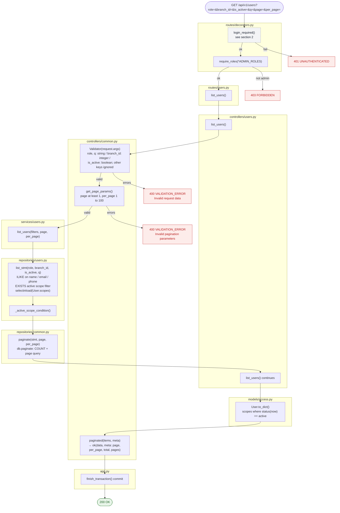
```mermaid
flowchart TD
    classDef err fill:#fdecea,stroke:#c62828,color:#b71c1c
    classDef done fill:#e8f5e9,stroke:#2e7d32,color:#1b5e20
    classDef shared fill:#f3f4f6,stroke:#6b7280,stroke-dasharray:4 3,color:#111827

    REQ(["GET /api/v1/users?role=&branch_id=&is_active=&q=&page=&per_page="])

    subgraph sgG["routes/decorators.py"]
        LR["login_required()<br/>see section 2"]:::shared
        RR["require_roles(*ADMIN_ROLES)"]
    end
    subgraph sgR["routes/users.py"]
        R1["list_users()"]
    end
    subgraph sgC["controllers/users.py"]
        C1["list_users()"]
        C2["list_users() continues"]
    end
    subgraph sgV["controllers/common.py"]
        V1["Validator(request.args)<br/>role, q: string / branch_id: integer /<br/>is_active: boolean; other keys ignored"]
        PG1["get_page_params()<br/>page at least 1, per_page 1 to 100"]
        OK["paginated(items, meta)<br/>→ ok(data, meta: page, per_page, total, pages)"]
    end
    subgraph sgS["services/users.py"]
        S1["list_users(filters, page, per_page)"]
    end
    subgraph sgU["repositories/users.py"]
        U1["list_stmt(role, branch_id, is_active, q)<br/>ILIKE on name / email / phone<br/>EXISTS active scope filter<br/>selectinload(User.scopes)"]
        U2["_active_scope_condition()"]
    end
    subgraph sgPg["repositories/common.py"]
        PG2["paginate(stmt, page, per_page)<br/>db.paginate: COUNT + page query"]
    end
    subgraph sgM["models/access.py"]
        D1["User.to_dict()<br/>scopes where status(now) == active"]
    end
    subgraph sgTx["app.py"]
        FT["finish_transaction() commit"]
    end

    E401["401 UNAUTHENTICATED"]:::err
    E403["403 FORBIDDEN"]:::err
    E400Q["400 VALIDATION_ERROR<br/>Invalid request data"]:::err
    E400P["400 VALIDATION_ERROR<br/>Invalid pagination parameters"]:::err
    RES(["200 OK"]):::done

    REQ --> LR
    LR -->|fail| E401
    LR -->|ok| RR
    RR -->|not admin| E403
    RR -->|ok| R1 --> C1 --> V1
    V1 -->|errors| E400Q
    V1 -->|valid| PG1
    PG1 -->|errors| E400P
    PG1 -->|valid| S1 --> U1 --> U2 --> PG2 --> C2 --> D1 --> OK --> FT --> RES
```

| # | Location | Function |
|---|---|---|
| 1 | [routes/users.py:14](../backend/routes/users.py#L14) | `list_users` |
| 2 | [controllers/users.py:14](../backend/controllers/users.py#L14) | `list_users` (Validator rules) |
| 3 | [controllers/common.py:307](../backend/controllers/common.py#L307) | `get_page_params` |
| 4 | [services/users.py:31](../backend/services/users.py#L31) | `list_users` |
| 5 | [repositories/users.py:86](../backend/repositories/users.py#L86) | `list_stmt` |
| 6 | [repositories/common.py:7](../backend/repositories/common.py#L7) | `paginate` |
| 7 | [models/access.py:61](../backend/models/access.py#L61) | `User.to_dict` |
| 8 | [controllers/common.py:39](../backend/controllers/common.py#L39) | `paginated` |

---

### 5.10 POST `/api/v1/users`

Admin + fresh auth. Body: `{full_name, email, phone?, person_id?, is_recovery_account?, scopes: [{role_code, branch_id?, expires_at?}, ...]}`. Returns the user and a **one-time** temporary password.

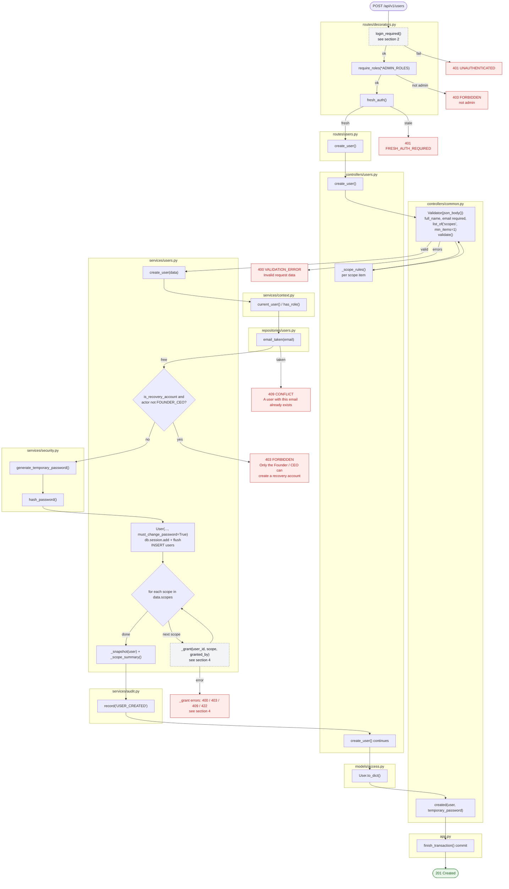
```mermaid
flowchart TD
    classDef err fill:#fdecea,stroke:#c62828,color:#b71c1c
    classDef done fill:#e8f5e9,stroke:#2e7d32,color:#1b5e20
    classDef shared fill:#f3f4f6,stroke:#6b7280,stroke-dasharray:4 3,color:#111827

    REQ(["POST /api/v1/users"])

    subgraph sgG["routes/decorators.py"]
        LR["login_required()<br/>see section 2"]:::shared
        RR["require_roles(*ADMIN_ROLES)"]
        FA["fresh_auth()"]
    end
    subgraph sgR["routes/users.py"]
        R1["create_user()"]
    end
    subgraph sgC["controllers/users.py"]
        C1["create_user()"]
        SR["_scope_rules()<br/>per scope item"]
        C2["create_user() continues"]
    end
    subgraph sgV["controllers/common.py"]
        V1["Validator(json_body())<br/>full_name, email required,<br/>list_of('scopes', min_items=1)<br/>validate()"]
        OK["created(user, temporary_password)"]
    end
    subgraph sgS["services/users.py"]
        S1["create_user(data)"]
        S2{"is_recovery_account and<br/>actor not FOUNDER_CEO?"}
        S3["User(..., must_change_password=True)<br/>db.session.add + flush<br/>INSERT users"]
        S4{"for each scope in data.scopes"}
        GR["_grant(user_id, scope, granted_by)<br/>see section 4"]:::shared
        S5["_snapshot(user) + _scope_summary()"]
    end
    subgraph sgCtx["services/context.py"]
        X1["current_user() / has_role()"]
    end
    subgraph sgU["repositories/users.py"]
        U1["email_taken(email)"]
    end
    subgraph sgSec["services/security.py"]
        P1["generate_temporary_password()"]
        P2["hash_password()"]
    end
    subgraph sgA["services/audit.py"]
        A1["record('USER_CREATED')"]
    end
    subgraph sgM["models/access.py"]
        D1["User.to_dict()"]
    end
    subgraph sgTx["app.py"]
        FT["finish_transaction() commit"]
    end

    E401["401 UNAUTHENTICATED"]:::err
    E403R["403 FORBIDDEN<br/>not admin"]:::err
    E401F["401 FRESH_AUTH_REQUIRED"]:::err
    E400["400 VALIDATION_ERROR<br/>Invalid request data"]:::err
    E409["409 CONFLICT<br/>A user with this email already exists"]:::err
    E403C["403 FORBIDDEN<br/>Only the Founder / CEO can<br/>create a recovery account"]:::err
    EG["_grant errors: 400 / 403 / 409 / 422<br/>see section 4"]:::err
    RES(["201 Created"]):::done

    REQ --> LR
    LR -->|fail| E401
    LR -->|ok| RR
    RR -->|not admin| E403R
    RR -->|ok| FA
    FA -->|stale| E401F
    FA -->|fresh| R1 --> C1 --> V1
    V1 --> SR --> V1
    V1 -->|errors| E400
    V1 -->|valid| S1 --> X1 --> U1
    U1 -->|taken| E409
    U1 -->|free| S2
    S2 -->|yes| E403C
    S2 -->|no| P1 --> P2 --> S3 --> S4
    S4 -->|next scope| GR --> S4
    GR -->|error| EG
    S4 -->|done| S5 --> A1 --> C2 --> D1 --> OK --> FT --> RES
```

| # | Location | Function |
|---|---|---|
| 1 | [routes/users.py:22](../backend/routes/users.py#L22) | `create_user` |
| 2 | [controllers/users.py:27](../backend/controllers/users.py#L27) | `create_user` (Validator rules; `_scope_rules`, [:8](../backend/controllers/users.py#L8)) |
| 3 | [services/users.py:43](../backend/services/users.py#L43) | `create_user` |
| 4 | [repositories/users.py:24](../backend/repositories/users.py#L24) | `email_taken` |
| 5 | [services/security.py:43](../backend/services/security.py#L43), [:15](../backend/services/security.py#L15) | `generate_temporary_password`, `hash_password` |
| 6 | [services/users.py:135](../backend/services/users.py#L135) | `_grant` (per scope) |
| 7 | [services/audit.py:17](../backend/services/audit.py#L17) | `record("USER_CREATED")` |
| 8 | [controllers/common.py:31](../backend/controllers/common.py#L31) | `created` |

---

### 5.11 GET `/api/v1/users/<user_id>`

Admin. `<int:user_id>`: a non-integer id never reaches the view and returns a werkzeug 404.

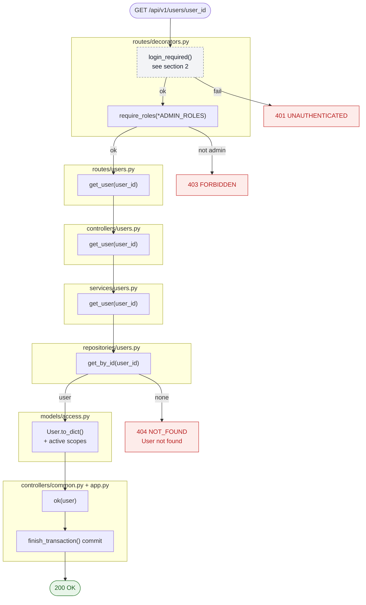
```mermaid
flowchart TD
    classDef err fill:#fdecea,stroke:#c62828,color:#b71c1c
    classDef done fill:#e8f5e9,stroke:#2e7d32,color:#1b5e20
    classDef shared fill:#f3f4f6,stroke:#6b7280,stroke-dasharray:4 3,color:#111827

    REQ(["GET /api/v1/users/user_id"])

    subgraph sgG["routes/decorators.py"]
        LR["login_required()<br/>see section 2"]:::shared
        RR["require_roles(*ADMIN_ROLES)"]
    end
    subgraph sgR["routes/users.py"]
        R1["get_user(user_id)"]
    end
    subgraph sgC["controllers/users.py"]
        C1["get_user(user_id)"]
    end
    subgraph sgS["services/users.py"]
        S1["get_user(user_id)"]
    end
    subgraph sgU["repositories/users.py"]
        U1["get_by_id(user_id)"]
    end
    subgraph sgM["models/access.py"]
        D1["User.to_dict()<br/>+ active scopes"]
    end
    subgraph sgResp["controllers/common.py + app.py"]
        OK["ok(user)"]
        FT["finish_transaction() commit"]
    end

    E401["401 UNAUTHENTICATED"]:::err
    E403["403 FORBIDDEN"]:::err
    E404["404 NOT_FOUND<br/>User not found"]:::err
    RES(["200 OK"]):::done

    REQ --> LR
    LR -->|fail| E401
    LR -->|ok| RR
    RR -->|not admin| E403
    RR -->|ok| R1 --> C1 --> S1 --> U1
    U1 -->|none| E404
    U1 -->|user| D1 --> OK --> FT --> RES
```

| # | Location | Function |
|---|---|---|
| 1 | [routes/users.py:29](../backend/routes/users.py#L29) | `get_user` |
| 2 | [controllers/users.py:42](../backend/controllers/users.py#L42) | `get_user` |
| 3 | [services/users.py:36](../backend/services/users.py#L36) | `get_user` |
| 4 | [repositories/users.py:16](../backend/repositories/users.py#L16) | `get_by_id` |

---

### 5.12 PATCH `/api/v1/users/<user_id>`

Admin (no fresh auth). Body: any of `{full_name, email, phone, is_active}`, with at least one field. Deactivating a user signs out all of their sessions.

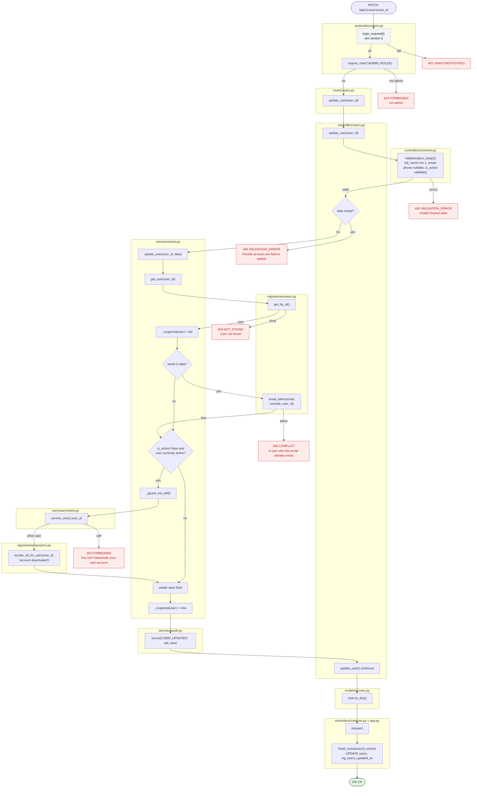
```mermaid
flowchart TD
    classDef err fill:#fdecea,stroke:#c62828,color:#b71c1c
    classDef done fill:#e8f5e9,stroke:#2e7d32,color:#1b5e20
    classDef shared fill:#f3f4f6,stroke:#6b7280,stroke-dasharray:4 3,color:#111827

    REQ(["PATCH /api/v1/users/user_id"])

    subgraph sgG["routes/decorators.py"]
        LR["login_required()<br/>see section 2"]:::shared
        RR["require_roles(*ADMIN_ROLES)"]
    end
    subgraph sgR["routes/users.py"]
        R1["update_user(user_id)"]
    end
    subgraph sgC["controllers/users.py"]
        C1["update_user(user_id)"]
        CE{"data empty?"}
        C2["update_user() continues"]
    end
    subgraph sgV["controllers/common.py"]
        V1["Validator(json_body())<br/>full_name min 1, email,<br/>phone nullable, is_active<br/>validate()"]
    end
    subgraph sgS["services/users.py"]
        S1["update_user(user_id, data)"]
        S2["get_user(user_id)"]
        S3["_snapshot(user) = old"]
        S4{"email in data?"}
        S5{"is_active False and<br/>user currently active?"}
        S6["_guard_not_self()"]
        S7["setattr each field"]
        S8["_snapshot(user) = new"]
    end
    subgraph sgU["repositories/users.py"]
        U1["get_by_id()"]
        U2["email_taken(email,<br/>exclude_user_id)"]
    end
    subgraph sgCtx["services/context.py"]
        X1["current_user().user_id"]
    end
    subgraph sgSess["repositories/sessions.py"]
        SS1["revoke_all_for_user(user_id,<br/>'account deactivated')"]
    end
    subgraph sgA["services/audit.py"]
        A1["record('USER_UPDATED', old, new)"]
    end
    subgraph sgM["models/access.py"]
        D1["User.to_dict()"]
    end
    subgraph sgResp["controllers/common.py + app.py"]
        OK["ok(user)"]
        FT["finish_transaction() commit<br/>UPDATE users, trg_users_updated_at"]
    end

    E401["401 UNAUTHENTICATED"]:::err
    E403["403 FORBIDDEN<br/>not admin"]:::err
    E400["400 VALIDATION_ERROR<br/>Invalid request data"]:::err
    E400E["400 VALIDATION_ERROR<br/>Provide at least one field to update"]:::err
    E404["404 NOT_FOUND<br/>User not found"]:::err
    E409["409 CONFLICT<br/>A user with this email already exists"]:::err
    E403S["403 FORBIDDEN<br/>You can't deactivate your own account"]:::err
    RES(["200 OK"]):::done

    REQ --> LR
    LR -->|fail| E401
    LR -->|ok| RR
    RR -->|not admin| E403
    RR -->|ok| R1 --> C1 --> V1
    V1 -->|errors| E400
    V1 -->|valid| CE
    CE -->|yes| E400E
    CE -->|no| S1 --> S2 --> U1
    U1 -->|none| E404
    U1 -->|user| S3 --> S4
    S4 -->|yes| U2
    U2 -->|taken| E409
    U2 -->|free| S5
    S4 -->|no| S5
    S5 -->|yes| S6 --> X1
    X1 -->|self| E403S
    X1 -->|other user| SS1 --> S7
    S5 -->|no| S7
    S7 --> S8 --> A1 --> C2 --> D1 --> OK --> FT --> RES
```

| # | Location | Function |
|---|---|---|
| 1 | [routes/users.py:36](../backend/routes/users.py#L36) | `update_user` |
| 2 | [controllers/users.py:46](../backend/controllers/users.py#L46) | `update_user` (Validator rules + empty check) |
| 3 | [services/users.py:70](../backend/services/users.py#L70) | `update_user` |
| 4 | [services/users.py:24](../backend/services/users.py#L24) | `_guard_not_self` |
| 5 | [repositories/sessions.py:52](../backend/repositories/sessions.py#L52) | `revoke_all_for_user` |

---

### 5.13 POST `/api/v1/users/<user_id>/reset-password`

Admin + fresh auth. Issues a new temporary password, unlocks the account and signs out every session for that user.

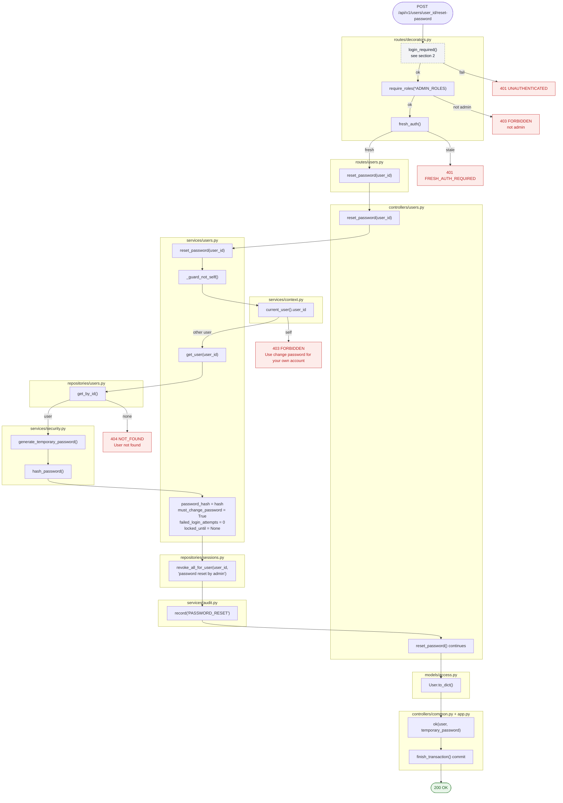
```mermaid
flowchart TD
    classDef err fill:#fdecea,stroke:#c62828,color:#b71c1c
    classDef done fill:#e8f5e9,stroke:#2e7d32,color:#1b5e20
    classDef shared fill:#f3f4f6,stroke:#6b7280,stroke-dasharray:4 3,color:#111827

    REQ(["POST /api/v1/users/user_id/reset-password"])

    subgraph sgG["routes/decorators.py"]
        LR["login_required()<br/>see section 2"]:::shared
        RR["require_roles(*ADMIN_ROLES)"]
        FA["fresh_auth()"]
    end
    subgraph sgR["routes/users.py"]
        R1["reset_password(user_id)"]
    end
    subgraph sgC["controllers/users.py"]
        C1["reset_password(user_id)"]
        C2["reset_password() continues"]
    end
    subgraph sgS["services/users.py"]
        S1["reset_password(user_id)"]
        S2["_guard_not_self()"]
        S3["get_user(user_id)"]
        S4["password_hash = hash<br/>must_change_password = True<br/>failed_login_attempts = 0<br/>locked_until = None"]
    end
    subgraph sgCtx["services/context.py"]
        X1["current_user().user_id"]
    end
    subgraph sgU["repositories/users.py"]
        U1["get_by_id()"]
    end
    subgraph sgSec["services/security.py"]
        P1["generate_temporary_password()"]
        P2["hash_password()"]
    end
    subgraph sgSess["repositories/sessions.py"]
        SS1["revoke_all_for_user(user_id,<br/>'password reset by admin')"]
    end
    subgraph sgA["services/audit.py"]
        A1["record('PASSWORD_RESET')"]
    end
    subgraph sgM["models/access.py"]
        D1["User.to_dict()"]
    end
    subgraph sgResp["controllers/common.py + app.py"]
        OK["ok(user, temporary_password)"]
        FT["finish_transaction() commit"]
    end

    E401["401 UNAUTHENTICATED"]:::err
    E403R["403 FORBIDDEN<br/>not admin"]:::err
    E401F["401 FRESH_AUTH_REQUIRED"]:::err
    E403S["403 FORBIDDEN<br/>Use change password for your own account"]:::err
    E404["404 NOT_FOUND<br/>User not found"]:::err
    RES(["200 OK"]):::done

    REQ --> LR
    LR -->|fail| E401
    LR -->|ok| RR
    RR -->|not admin| E403R
    RR -->|ok| FA
    FA -->|stale| E401F
    FA -->|fresh| R1 --> C1 --> S1 --> S2 --> X1
    X1 -->|self| E403S
    X1 -->|other user| S3 --> U1
    U1 -->|none| E404
    U1 -->|user| P1 --> P2 --> S4 --> SS1 --> A1 --> C2 --> D1 --> OK --> FT --> RES
```

| # | Location | Function |
|---|---|---|
| 1 | [routes/users.py:44](../backend/routes/users.py#L44) | `reset_password` |
| 2 | [controllers/users.py:59](../backend/controllers/users.py#L59) | `reset_password` |
| 3 | [services/users.py:89](../backend/services/users.py#L89) | `reset_password` |
| 4 | [repositories/sessions.py:52](../backend/repositories/sessions.py#L52) | `revoke_all_for_user` |

---

### 5.14 GET `/api/v1/users/<user_id>/scopes`

Admin. Returns every scope, including expired and revoked ones, each with a computed `status`.

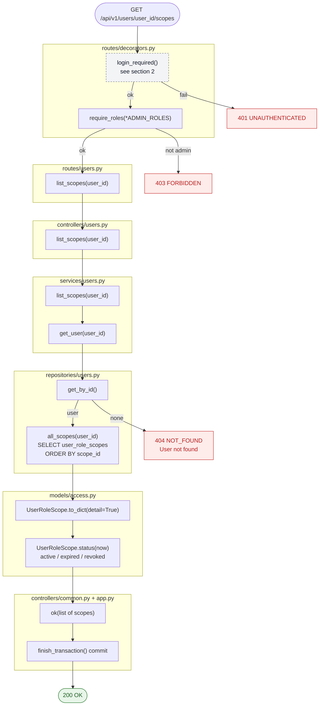
```mermaid
flowchart TD
    classDef err fill:#fdecea,stroke:#c62828,color:#b71c1c
    classDef done fill:#e8f5e9,stroke:#2e7d32,color:#1b5e20
    classDef shared fill:#f3f4f6,stroke:#6b7280,stroke-dasharray:4 3,color:#111827

    REQ(["GET /api/v1/users/user_id/scopes"])

    subgraph sgG["routes/decorators.py"]
        LR["login_required()<br/>see section 2"]:::shared
        RR["require_roles(*ADMIN_ROLES)"]
    end
    subgraph sgR["routes/users.py"]
        R1["list_scopes(user_id)"]
    end
    subgraph sgC["controllers/users.py"]
        C1["list_scopes(user_id)"]
    end
    subgraph sgS["services/users.py"]
        S1["list_scopes(user_id)"]
        S2["get_user(user_id)"]
    end
    subgraph sgU["repositories/users.py"]
        U1["get_by_id()"]
        U2["all_scopes(user_id)<br/>SELECT user_role_scopes<br/>ORDER BY scope_id"]
    end
    subgraph sgM["models/access.py"]
        D1["UserRoleScope.to_dict(detail=True)"]
        M1["UserRoleScope.status(now)<br/>active / expired / revoked"]
    end
    subgraph sgResp["controllers/common.py + app.py"]
        OK["ok(list of scopes)"]
        FT["finish_transaction() commit"]
    end

    E401["401 UNAUTHENTICATED"]:::err
    E403["403 FORBIDDEN"]:::err
    E404["404 NOT_FOUND<br/>User not found"]:::err
    RES(["200 OK"]):::done

    REQ --> LR
    LR -->|fail| E401
    LR -->|ok| RR
    RR -->|not admin| E403
    RR -->|ok| R1 --> C1 --> S1 --> S2 --> U1
    U1 -->|none| E404
    U1 -->|user| U2 --> D1 --> M1 --> OK --> FT --> RES
```

| # | Location | Function |
|---|---|---|
| 1 | [routes/users.py:51](../backend/routes/users.py#L51) | `list_scopes` |
| 2 | [controllers/users.py:64](../backend/controllers/users.py#L64) | `list_scopes` |
| 3 | [services/users.py:106](../backend/services/users.py#L106) | `list_scopes` |
| 4 | [repositories/users.py:41](../backend/repositories/users.py#L41) | `all_scopes` |
| 5 | [models/access.py:107](../backend/models/access.py#L107) | `UserRoleScope.to_dict` |

---

### 5.15 POST `/api/v1/users/<user_id>/scopes`

Admin + fresh auth. Body: `{role_code, branch_id?, expires_at?}`.

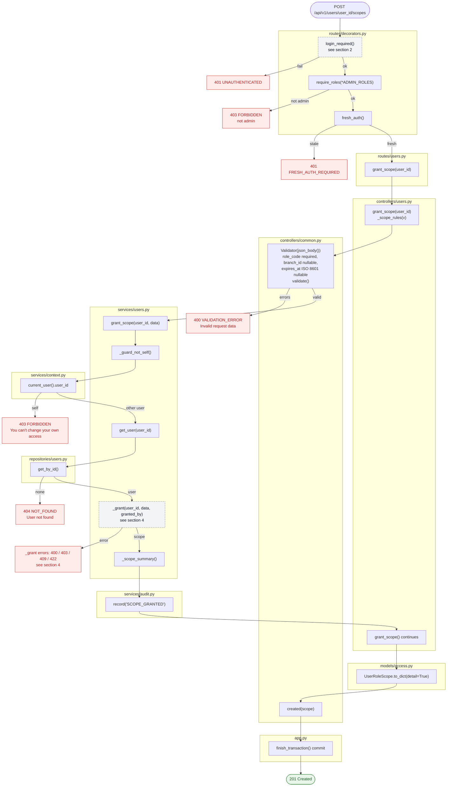
```mermaid
flowchart TD
    classDef err fill:#fdecea,stroke:#c62828,color:#b71c1c
    classDef done fill:#e8f5e9,stroke:#2e7d32,color:#1b5e20
    classDef shared fill:#f3f4f6,stroke:#6b7280,stroke-dasharray:4 3,color:#111827

    REQ(["POST /api/v1/users/user_id/scopes"])

    subgraph sgG["routes/decorators.py"]
        LR["login_required()<br/>see section 2"]:::shared
        RR["require_roles(*ADMIN_ROLES)"]
        FA["fresh_auth()"]
    end
    subgraph sgR["routes/users.py"]
        R1["grant_scope(user_id)"]
    end
    subgraph sgC["controllers/users.py"]
        C1["grant_scope(user_id)<br/>_scope_rules(v)"]
        C2["grant_scope() continues"]
    end
    subgraph sgV["controllers/common.py"]
        V1["Validator(json_body())<br/>role_code required, branch_id nullable,<br/>expires_at ISO 8601 nullable<br/>validate()"]
        OK["created(scope)"]
    end
    subgraph sgS["services/users.py"]
        S1["grant_scope(user_id, data)"]
        S2["_guard_not_self()"]
        S3["get_user(user_id)"]
        GR["_grant(user_id, data, granted_by)<br/>see section 4"]:::shared
        S4["_scope_summary()"]
    end
    subgraph sgCtx["services/context.py"]
        X1["current_user().user_id"]
    end
    subgraph sgU["repositories/users.py"]
        U1["get_by_id()"]
    end
    subgraph sgA["services/audit.py"]
        A1["record('SCOPE_GRANTED')"]
    end
    subgraph sgM["models/access.py"]
        D1["UserRoleScope.to_dict(detail=True)"]
    end
    subgraph sgTx["app.py"]
        FT["finish_transaction() commit"]
    end

    E401["401 UNAUTHENTICATED"]:::err
    E403R["403 FORBIDDEN<br/>not admin"]:::err
    E401F["401 FRESH_AUTH_REQUIRED"]:::err
    E400["400 VALIDATION_ERROR<br/>Invalid request data"]:::err
    E403S["403 FORBIDDEN<br/>You can't change your own access"]:::err
    E404["404 NOT_FOUND<br/>User not found"]:::err
    EG["_grant errors: 400 / 403 / 409 / 422<br/>see section 4"]:::err
    RES(["201 Created"]):::done

    REQ --> LR
    LR -->|fail| E401
    LR -->|ok| RR
    RR -->|not admin| E403R
    RR -->|ok| FA
    FA -->|stale| E401F
    FA -->|fresh| R1 --> C1 --> V1
    V1 -->|errors| E400
    V1 -->|valid| S1 --> S2 --> X1
    X1 -->|self| E403S
    X1 -->|other user| S3 --> U1
    U1 -->|none| E404
    U1 -->|user| GR
    GR -->|error| EG
    GR -->|scope| S4 --> A1 --> C2 --> D1 --> OK --> FT --> RES
```

| # | Location | Function |
|---|---|---|
| 1 | [routes/users.py:59](../backend/routes/users.py#L59) | `grant_scope` |
| 2 | [controllers/users.py:68](../backend/controllers/users.py#L68) | `grant_scope` (`_scope_rules`, [:8](../backend/controllers/users.py#L8)) |
| 3 | [services/users.py:111](../backend/services/users.py#L111) | `grant_scope` |
| 4 | [services/users.py:135](../backend/services/users.py#L135) | `_grant` |

---

### 5.16 DELETE `/api/v1/users/<user_id>/scopes/<scope_id>`

Admin + fresh auth. This is a soft revoke: it sets `revoked_at` and never deletes the row. It returns **200 with the revoked scope**, not 204.

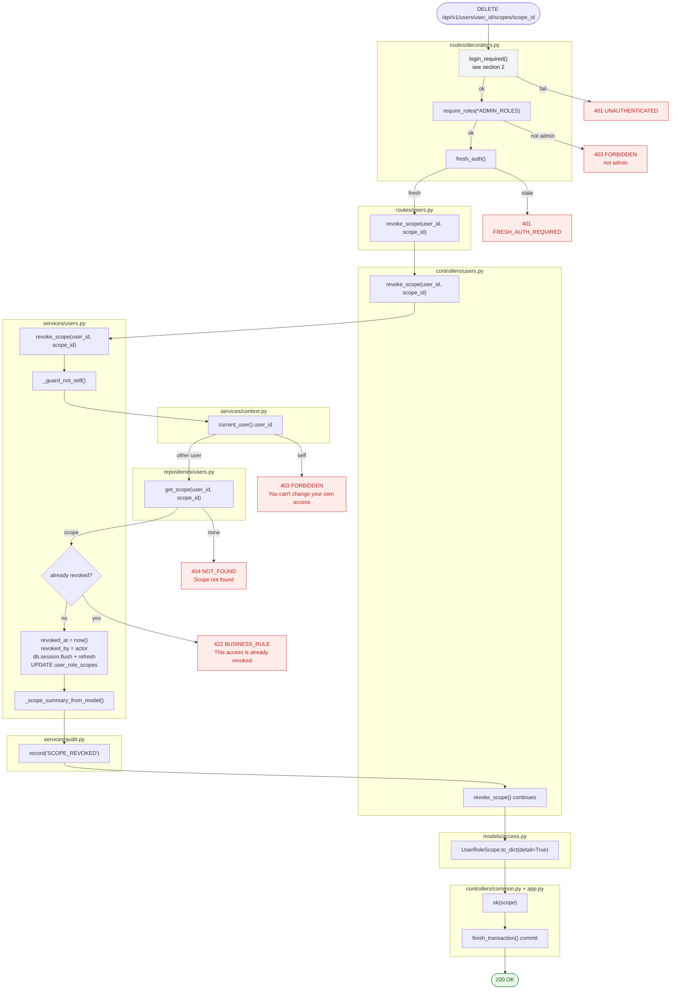
```mermaid
flowchart TD
    classDef err fill:#fdecea,stroke:#c62828,color:#b71c1c
    classDef done fill:#e8f5e9,stroke:#2e7d32,color:#1b5e20
    classDef shared fill:#f3f4f6,stroke:#6b7280,stroke-dasharray:4 3,color:#111827

    REQ(["DELETE /api/v1/users/user_id/scopes/scope_id"])

    subgraph sgG["routes/decorators.py"]
        LR["login_required()<br/>see section 2"]:::shared
        RR["require_roles(*ADMIN_ROLES)"]
        FA["fresh_auth()"]
    end
    subgraph sgR["routes/users.py"]
        R1["revoke_scope(user_id, scope_id)"]
    end
    subgraph sgC["controllers/users.py"]
        C1["revoke_scope(user_id, scope_id)"]
        C2["revoke_scope() continues"]
    end
    subgraph sgS["services/users.py"]
        S1["revoke_scope(user_id, scope_id)"]
        S2["_guard_not_self()"]
        S3{"already revoked?"}
        S4["revoked_at = now()<br/>revoked_by = actor<br/>db.session.flush + refresh<br/>UPDATE user_role_scopes"]
        S5["_scope_summary_from_model()"]
    end
    subgraph sgCtx["services/context.py"]
        X1["current_user().user_id"]
    end
    subgraph sgU["repositories/users.py"]
        U1["get_scope(user_id, scope_id)"]
    end
    subgraph sgA["services/audit.py"]
        A1["record('SCOPE_REVOKED')"]
    end
    subgraph sgM["models/access.py"]
        D1["UserRoleScope.to_dict(detail=True)"]
    end
    subgraph sgResp["controllers/common.py + app.py"]
        OK["ok(scope)"]
        FT["finish_transaction() commit"]
    end

    E401["401 UNAUTHENTICATED"]:::err
    E403R["403 FORBIDDEN<br/>not admin"]:::err
    E401F["401 FRESH_AUTH_REQUIRED"]:::err
    E403S["403 FORBIDDEN<br/>You can't change your own access"]:::err
    E404["404 NOT_FOUND<br/>Scope not found"]:::err
    E422["422 BUSINESS_RULE<br/>This access is already revoked"]:::err
    RES(["200 OK"]):::done

    REQ --> LR
    LR -->|fail| E401
    LR -->|ok| RR
    RR -->|not admin| E403R
    RR -->|ok| FA
    FA -->|stale| E401F
    FA -->|fresh| R1 --> C1 --> S1 --> S2 --> X1
    X1 -->|self| E403S
    X1 -->|other user| U1
    U1 -->|none| E404
    U1 -->|scope| S3
    S3 -->|yes| E422
    S3 -->|no| S4 --> S5 --> A1 --> C2 --> D1 --> OK --> FT --> RES
```

| # | Location | Function |
|---|---|---|
| 1 | [routes/users.py:67](../backend/routes/users.py#L67) | `revoke_scope` |
| 2 | [controllers/users.py:74](../backend/controllers/users.py#L74) | `revoke_scope` |
| 3 | [services/users.py:119](../backend/services/users.py#L119) | `revoke_scope` |
| 4 | [repositories/users.py:46](../backend/repositories/users.py#L46) | `get_scope` |

---

### 5.17 GET `/api/v1/roles`

Logged in. Active roles, for dropdowns.

```mermaid
flowchart TD
    classDef err fill:#fdecea,stroke:#c62828,color:#b71c1c
    classDef done fill:#e8f5e9,stroke:#2e7d32,color:#1b5e20
    classDef shared fill:#f3f4f6,stroke:#6b7280,stroke-dasharray:4 3,color:#111827

    REQ(["GET /api/v1/roles"])
    LR["routes/decorators.py · login_required()<br/>see section 2"]:::shared

    subgraph sgR["routes/reference.py"]
        R1["list_roles()"]
    end
    subgraph sgC["controllers/reference.py"]
        C1["list_roles()"]
    end
    subgraph sgS["services/reference.py"]
        S1["list_roles()<br/>SELECT roles WHERE is_active<br/>ORDER BY role_id"]
    end
    subgraph sgM["models/access.py"]
        D1["Role.to_dict() per role"]
    end
    subgraph sgResp["controllers/common.py + app.py"]
        OK["ok(list of roles)"]
        FT["finish_transaction() commit"]
    end

    E401["401 UNAUTHENTICATED"]:::err
    E403["403 PASSWORD_CHANGE_REQUIRED"]:::err
    RES(["200 OK"]):::done

    REQ --> LR
    LR -->|fail| E401
    LR -->|temporary password| E403
    LR -->|ok| R1 --> C1 --> S1 --> D1 --> OK --> FT --> RES
```

| # | Location | Function |
|---|---|---|
| 1 | [routes/reference.py:11](../backend/routes/reference.py#L11) | `list_roles` |
| 2 | [controllers/reference.py:7](../backend/controllers/reference.py#L7) | `list_roles` |
| 3 | [services/reference.py:11](../backend/services/reference.py#L11) | `list_roles` |
| 4 | [models/access.py:24](../backend/models/access.py#L24) | `Role.to_dict` |

---

### 5.18 GET `/api/v1/branches`

Logged in. Lives in the masters blueprint. Returns **all** active branches, with no filter by the caller's scopes. The caller's own branches come from `allowed_branches` in `/auth/me`.

```mermaid
flowchart TD
    classDef err fill:#fdecea,stroke:#c62828,color:#b71c1c
    classDef done fill:#e8f5e9,stroke:#2e7d32,color:#1b5e20
    classDef shared fill:#f3f4f6,stroke:#6b7280,stroke-dasharray:4 3,color:#111827

    REQ(["GET /api/v1/branches"])
    LR["routes/decorators.py · login_required()<br/>see section 2"]:::shared

    subgraph sgR["routes/masters.py"]
        R1["list_branches()"]
    end
    subgraph sgC["controllers/masters.py"]
        C1["list_branches()"]
    end
    subgraph sgS["services/branches.py"]
        S1["list_branches()<br/>SELECT branches WHERE is_active<br/>ORDER BY branch_id"]
    end
    subgraph sgM["models/masters.py"]
        D1["Branch.to_dict() per branch"]
    end
    subgraph sgResp["controllers/common.py + app.py"]
        OK["ok(list of branches)"]
        FT["finish_transaction() commit"]
    end

    E401["401 UNAUTHENTICATED"]:::err
    E403["403 PASSWORD_CHANGE_REQUIRED"]:::err
    RES(["200 OK"]):::done

    REQ --> LR
    LR -->|fail| E401
    LR -->|temporary password| E403
    LR -->|ok| R1 --> C1 --> S1 --> D1 --> OK --> FT --> RES
```

| # | Location | Function |
|---|---|---|
| 1 | [routes/masters.py:44](../backend/routes/masters.py#L44) | `list_branches` |
| 2 | [controllers/masters.py:55](../backend/controllers/masters.py#L55) | `list_branches` |
| 3 | [services/branches.py:12](../backend/services/branches.py#L12) | `list_branches` |
| 4 | [models/masters.py:25](../backend/models/masters.py#L25) | `Branch.to_dict` |

---

### 5.19 GET `/api/v1/branches/<branch_id>`

Logged in (no role check and no branch-scope check in the code). Returns one branch, active or not.

```mermaid
flowchart TD
    classDef err fill:#fdecea,stroke:#c62828,color:#b71c1c
    classDef done fill:#e8f5e9,stroke:#2e7d32,color:#1b5e20
    classDef shared fill:#f3f4f6,stroke:#6b7280,stroke-dasharray:4 3,color:#111827

    REQ(["GET /api/v1/branches/branch_id"])
    LR["routes/decorators.py · login_required()<br/>see section 2"]:::shared

    subgraph sgR["routes/masters.py"]
        R1["get_branch(branch_id)"]
    end
    subgraph sgC["controllers/masters.py"]
        C1["get_branch(branch_id)"]
    end
    subgraph sgS["services/branches.py"]
        S1["get_branch(branch_id)<br/>db.session.get(Branch, branch_id)"]
    end
    subgraph sgM["models/masters.py"]
        D1["Branch.to_dict()"]
    end
    subgraph sgResp["controllers/common.py + app.py"]
        OK["ok(branch)"]
        FT["finish_transaction() commit"]
    end

    E401["401 UNAUTHENTICATED"]:::err
    E403["403 PASSWORD_CHANGE_REQUIRED"]:::err
    E404["404 NOT_FOUND<br/>Branch not found"]:::err
    RES(["200 OK"]):::done

    REQ --> LR
    LR -->|fail| E401
    LR -->|temporary password| E403
    LR -->|ok| R1 --> C1 --> S1
    S1 -->|none| E404
    S1 -->|branch| D1 --> OK --> FT --> RES
```

| # | Location | Function |
|---|---|---|
| 1 | [routes/masters.py:50](../backend/routes/masters.py#L50) | `get_branch` |
| 2 | [controllers/masters.py:59](../backend/controllers/masters.py#L59) | `get_branch` |
| 3 | [services/branches.py:16](../backend/services/branches.py#L16) | `get_branch` |

---

### 5.20 PATCH `/api/v1/branches/<branch_id>`

Admin (no fresh auth). Body: any of `{branch_name, city, address, phone, email}`, with at least one field. Contact details only; `branch_code` and `receipt_prefix` can't be changed here.

```mermaid
flowchart TD
    classDef err fill:#fdecea,stroke:#c62828,color:#b71c1c
    classDef done fill:#e8f5e9,stroke:#2e7d32,color:#1b5e20
    classDef shared fill:#f3f4f6,stroke:#6b7280,stroke-dasharray:4 3,color:#111827

    REQ(["PATCH /api/v1/branches/branch_id"])

    subgraph sgG["routes/decorators.py"]
        LR["login_required()<br/>see section 2"]:::shared
        RR["require_roles(*ADMIN_ROLES)"]
    end
    subgraph sgR["routes/masters.py"]
        R1["update_branch(branch_id)"]
    end
    subgraph sgC["controllers/masters.py"]
        C1["update_branch(branch_id)"]
        CE["_require_changes(data)"]
    end
    subgraph sgV["controllers/common.py"]
        V1["Validator(json_body())<br/>branch_name, city: min 1, max 100<br/>address, phone, email: nullable<br/>validate()"]
    end
    subgraph sgS["services/branches.py"]
        S1["update_branch(branch_id, data)"]
        S2["get_branch(branch_id)"]
        S3["old = branch.to_dict()<br/>setattr each field<br/>db.session.flush()"]
    end
    subgraph sgA["services/audit.py"]
        A1["record('BRANCH_UPDATED',<br/>old, new, branch_id)"]
    end
    subgraph sgM["models/masters.py"]
        D1["Branch.to_dict()"]
    end
    subgraph sgResp["controllers/common.py + app.py"]
        OK["ok(branch)"]
        FT["finish_transaction() commit"]
    end

    E401["401 UNAUTHENTICATED"]:::err
    E403["403 FORBIDDEN<br/>not admin"]:::err
    E400["400 VALIDATION_ERROR<br/>Invalid request data"]:::err
    E400E["400 VALIDATION_ERROR<br/>Provide at least one field to update"]:::err
    E404["404 NOT_FOUND<br/>Branch not found"]:::err
    EDB["DB error at flush<br/>mapped as in section 3"]:::err
    RES(["200 OK"]):::done

    REQ --> LR
    LR -->|fail| E401
    LR -->|ok| RR
    RR -->|not admin| E403
    RR -->|ok| R1 --> C1 --> V1
    V1 -->|errors| E400
    V1 -->|valid| CE
    CE -->|empty| E400E
    CE -->|data| S1 --> S2
    S2 -->|none| E404
    S2 -->|branch| S3
    S3 -->|constraint fails| EDB
    S3 -->|ok| A1 --> D1 --> OK --> FT --> RES
```

| # | Location | Function |
|---|---|---|
| 1 | [routes/masters.py:57](../backend/routes/masters.py#L57) | `update_branch` |
| 2 | [controllers/masters.py:63](../backend/controllers/masters.py#L63) | `update_branch` (Validator rules; `_require_changes`, [:13](../backend/controllers/masters.py#L13)) |
| 3 | [services/branches.py:23](../backend/services/branches.py#L23) | `update_branch` |
| 4 | [services/audit.py:17](../backend/services/audit.py#L17) | `record("BRANCH_UPDATED")` |

---

### 5.21 GET `/api/v1/staff`

Logged in. Query parameters: `branch_id` (optional, whole number 1 or more) and `role` (optional; repeatable and / or comma-separated, e.g. `?role=SALES,FRONT_OFFICE`, upper-cased). Staff directory for owner / trainer / task-owner pickers: active users with active scopes at the caller's branches plus company-wide scopes, one entry per user with every matching role.

```mermaid
flowchart TD
    classDef err fill:#fdecea,stroke:#c62828,color:#b71c1c
    classDef done fill:#e8f5e9,stroke:#2e7d32,color:#1b5e20
    classDef shared fill:#f3f4f6,stroke:#6b7280,stroke-dasharray:4 3,color:#111827

    REQ(["GET /api/v1/staff?branch_id=&role="])
    LR["routes/decorators.py · login_required()<br/>see section 2"]:::shared

    subgraph sgR["routes/reference.py"]
        R1["list_staff()"]
    end
    subgraph sgC["controllers/reference.py"]
        C1["list_staff()"]
        C2["roles = request.args.getlist('role')<br/>split on commas, strip, upper<br/>empty list → None"]
    end
    subgraph sgV["controllers/common.py"]
        V1["Validator(branch_id only)<br/>integer, min_value 1<br/>validate()"]
        OK["ok(list of staff)"]
    end
    subgraph sgS["services/reference.py"]
        S1["list_staff(branch_id, role_codes)"]
        S2{"branch_id given?"}
        S3{"allowed is not None and<br/>branch_id not in allowed?"}
        S4["allowed = {branch_id}"]
        S5["group scopes by user_id<br/>user_id, full_name,<br/>roles: role_code, role_name,<br/>branch_id, branch_code"]
    end
    subgraph sgCtx["services/context.py"]
        X1["current_user()"]
        X2["CurrentUser.branch_ids()<br/>None = all branches"]
    end
    subgraph sgU["repositories/users.py"]
        U1["staff_scopes(role_codes, allowed)<br/>active scopes of active users<br/>role_code IN roles (if given)<br/>branch_id IN allowed OR NULL (if not None)<br/>ORDER BY full_name, user_id, scope_id"]
        U2["_active_scope_condition()"]
    end
    subgraph sgTx["app.py"]
        FT["finish_transaction() commit"]
    end

    E401["401 UNAUTHENTICATED"]:::err
    E403["403 PASSWORD_CHANGE_REQUIRED"]:::err
    E400["400 VALIDATION_ERROR<br/>Invalid request data"]:::err
    E404["404 NOT_FOUND<br/>Branch not found"]:::err
    RES(["200 OK"]):::done

    REQ --> LR
    LR -->|fail| E401
    LR -->|temporary password| E403
    LR -->|ok| R1 --> C1 --> V1
    V1 -->|errors| E400
    V1 -->|valid| C2 --> S1 --> X1 --> X2 --> S2
    S2 -->|yes| S3
    S3 -->|yes| E404
    S3 -->|no| S4 --> U1
    S2 -->|no| U1
    U1 --> U2 --> S5 --> OK --> FT --> RES
```

| # | Location | Function |
|---|---|---|
| 1 | [routes/reference.py:17](../backend/routes/reference.py#L17) | `list_staff` |
| 2 | [controllers/reference.py:11](../backend/controllers/reference.py#L11) | `list_staff` (Validator rule + `role` parsing) |
| 3 | [services/reference.py:15](../backend/services/reference.py#L15) | `list_staff` |
| 4 | [services/context.py:57](../backend/services/context.py#L57) | `CurrentUser.branch_ids` |
| 5 | [repositories/users.py:104](../backend/repositories/users.py#L104) | `staff_scopes` |
