# Nipuna CRM — Role Guide

*What each role sees, what it can do, what it approves, and every setting that shapes that behaviour. Built from the live permission checks: `frontend/src/auth/access.ts` (screens), `backend/routes/*.py` (API guards), `backend/services/context.py` (role groups) and the seeded settings in the dev database.*

The server is the only real enforcement. The UI hides screens the server would refuse, but every action is re-checked by the API, and many rules (money, stages, approvals) are also enforced by the database itself.

---

## 1. The roles

| Code | Role | Branch scope | One-line job |
|---|---|---|---|
| `FOUNDER_CEO` | Founder / CEO | All branches | Final approver: big discounts, refunds, corrections, fee changes, targets |
| `SUPER_ADMIN` | Super Admin | All branches | Same approvals as Founder; runs users, settings and configuration |
| `BRANCH_MANAGER` | Branch Manager | Own branch | Runs the branch: assigns leads, approves small discounts, cancels / transfers admissions |
| `SALES` | Sales (Counsellor) | Own branch | Owns leads end to end until admission |
| `FRONT_OFFICE` | Front Office | Own branch | Walk-ins and phone enquiries; same lead work as counsellors |
| `ACCOUNTS` | Accounts | Own branch | Verifies payments, runs collections, pays out refunds, applies fee changes |
| `ACADEMIC_COORDINATOR` | Academic Coordinator | Own branch | Curricula, batches, allocation, completion, certificates |
| `TRAINER` | Trainer | Own branch | Runs demos and classes, records outcomes and joining dates |
| `PLACEMENT` | Placement Team | Own branch | Employers, jobs, placement profiles, applications |
| `HR` | HR | Own branch | Staff-side read access to students and tasks |
| `STUDENT` | Student | — | Reserved for a future student portal; no staff screens |

### Role groups used by the code

The API guards are written against these groups, so a rule like "Lead roles" below means exactly this list.

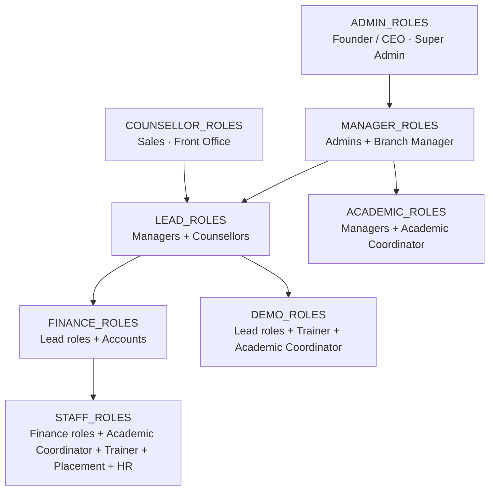

### Branch scoping

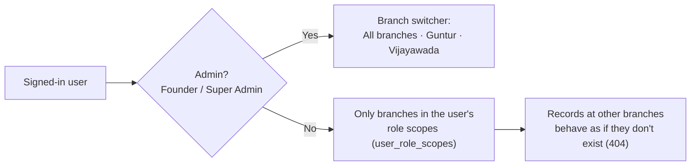

- A user can hold several **role + branch scopes** (e.g. Sales at Guntur and Trainer at Vijayawada). Each scope applies only at its own branch — scopes never combine into a stronger role.
- Scopes can carry an `expires_at` for temporary access.
- Person search (the duplicate check) deliberately works across branches so a second-branch enquiry is found.

---

## 2. Where each role lands after login

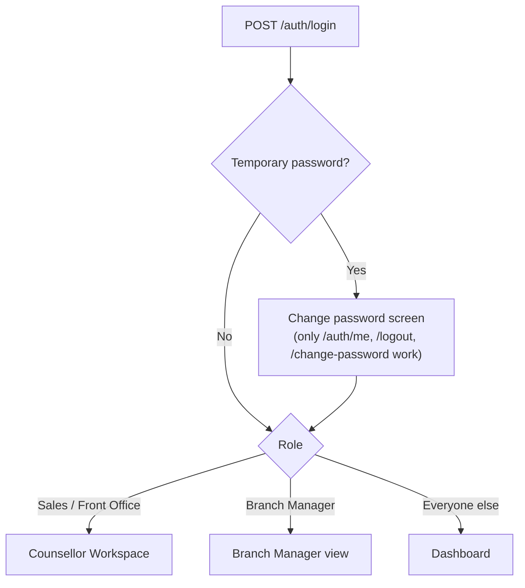

---

## 3. Screen access matrix

✅ = screen visible. Admin = Founder / CEO and Super Admin (identical for screens).

| Screen | Admin | BM | Sales / FO | Accounts | Acad. Coord. | Trainer | Placement | HR |
|---|---|---|---|---|---|---|---|---|
| Dashboard (Overview) | ✅ | ✅ | ✅ | ✅ | ✅ | ✅ | ✅ | ✅ |
| My work (V4) | ✅ | ✅ | ✅ | ✅ | ✅ | ✅ | ✅ | ✅ |
| LMS access (V4, read-only) | ✅ | ✅ | ✅ | ✅ | ✅ | ✅ | ✅ | ✅ |
| Workflow guide (V4) | ✅ | ✅ | ✅ | ✅ | ✅ | ✅ | ✅ | ✅ |
| Persons · Person 360 | ✅ | ✅ | ✅ | | | | | |
| Leads · Lead 360 | ✅ | ✅ | ✅ | | | | | |
| Deal pipeline | ✅ | ✅ | ✅ | | | | | |
| Demos | ✅ | ✅ | ✅ | | ✅ | ✅ | | |
| Admissions | ✅ | ✅ | ✅ | ✅ | ✅ | ✅ | ✅ | ✅ |
| Batches | ✅ | ✅ | | | ✅ | ✅ | | |
| Students · Student 360 | ✅ | ✅ | ✅ | ✅ | ✅ | ✅ | ✅ | ✅ |
| Payments | ✅ | ✅ | ✅ | ✅ | | | | |
| Invoices | ✅ | ✅ | ✅ | ✅ | | | | |
| Collections | ✅ | ✅ | ✅ | ✅ | | | | |
| Refunds | ✅ | ✅ | | ✅ | | | | |
| Tasks | ✅ | ✅ | ✅ | ✅ | ✅ | ✅ | ✅ | ✅ |
| Communications | ✅ | ✅ | ✅ | | | | | |
| Reports | ✅ | ✅ | | ✅ | | | | |
| Placement & Alumni | ✅ | ✅ | | | ✅ | | ✅ | |
| AI Copilot | ✅ | ✅ | ✅ | | | | | |
| Course Master | ✅ | ✅ | ✅ | ✅ | ✅ | ✅ | ✅ | ✅ |
| **More →** Counsellor Workspace | ✅ | ✅ | ✅ | | | | | |
| **More →** Branch Manager | ✅ | ✅ | | | | | | |
| **More →** Discount Approvals | ✅ | ✅ | | | | | | |
| **More →** Offer Master | ✅ | ✅ (view) | | | | | | |
| **More →** Target Master | ✅ | ✅ (view) | | ✅ (view) | | | | |
| **More →** Notifications | ✅ | ✅ | ✅ | ✅ | ✅ | ✅ | ✅ | ✅ |
| **More →** Ask Nipuna | ✅ | ✅ | | | | | | |
| **More →** Admin / Settings | ✅ | | | | | | | |

---

## 4. Role by role

### 4.1 Sales (Counsellor) and Front Office

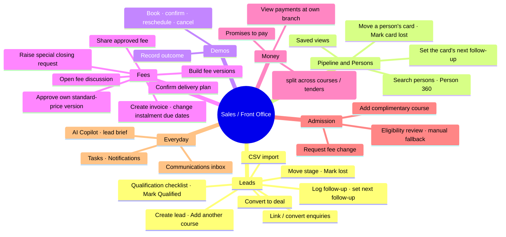

**Rules that apply to them**
- A counsellor who creates a lead **owns** it. Stage, follow-up, lost and edit need the owner (or a manager); while a lead is unassigned, any counsellor at the branch can work it.
- The same rule applies to a pipeline card: its owner (or a manager) moves it, marks it lost and sets its follow-up. Only a branch manager or admin changes the card's owner.
- Demos, fee discussions and stage moves need a **converted** lead: tick all six qualification checks, Mark Qualified, then Convert to deal (courses, branch, owner, expected close). Conversion reuses the person and never duplicates an open course.
- They **cannot** assign / bulk-assign / reactivate leads, approve discounts, verify payments, cancel admissions or touch settings.
- Front Office can also log follow-ups and record payments, same as Sales.

**Their core flow**

```mermaid
flowchart LR
    A["Create lead"] --> Q["Qualification<br/>(6 checks)"]
    Q --> K["Convert to deal"]
    K --> C["Book demo"]
    C --> D["Record outcome"]
    D --> E["Fee discussion<br/>+ fee version"]
    E -->|"extra concession"| F["Special closing request"]
    F -->|"approved"| G
    E -->|"no concession"| G["Approved fee"]
    G --> P["Confirm delivery plan"]
    P --> H["Create invoice<br/>(1+ courses, 1–3 instalments)"]
    H --> I["Record payment claim"]
    I -.->|"Accounts verifies → receipt"| J["Admission per course<br/>(automatic at ₹1,000)"]
```

### 4.2 Branch Manager

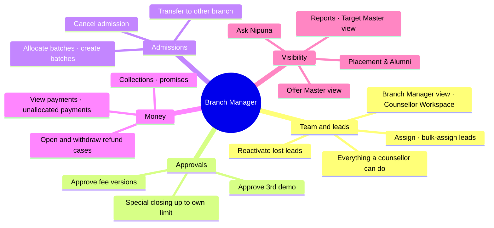

**Limits**
- Discount approval limit: **lower of 5% or ₹1,000** of the standard fee (setting: *Concession limits*). Anything above goes to Founder / CEO or Super Admin.
- **Cannot** verify payments, decide refunds, approve fee changes after admission, map curricula, create or activate offers, or open Admin / Settings.
- Gets a task for every **unassigned lead** (due in 60 staffed minutes) and is the escalation target for **payments waiting > 30 min**.

### 4.3 Accounts

```mermaid
mindmap
  root(("Accounts"))
    Payments
      Record payment claim
      Verify (evidence reviewed · cash check) or fail with reason
      Allocate advance to invoice courses
      Request correction
    Invoices
      Create invoice
      Cancel invoice
      Change instalment due date
    Collections
      Dues · ageing bands
      Promises to pay
    Refunds
      Open refund case
      Payout
      Reconcile
    Fee changes
      Apply approved fee change
    Visibility
      Reports · Target Master view
```

**Rules**
- Verification is **once and final** (Verified or Failed). Target: **30 minutes**, warning at 25, then escalates to the Branch Manager.
- Verifying needs two confirmations: **evidence reviewed** and, for cash, an **independent cash check**. The receipt number is issued only then; a pending claim has only its transaction number (`TXN-…`).
- Only verified payments count as collected or unlock admission — each course is admitted automatically on the verification that brings ₹1,000 (the token) onto it. Accounts may also create an admission from the eligibility review if an automatic one was refused.
- They get the "instalment due in 2 days" and "long payment gap" notifications for their branch, and can open the dashboard's Long-gap plans list.
- Accounts **pays out** refunds but never decides them; the decider can never be the one who pays out.

### 4.4 Academic Coordinator

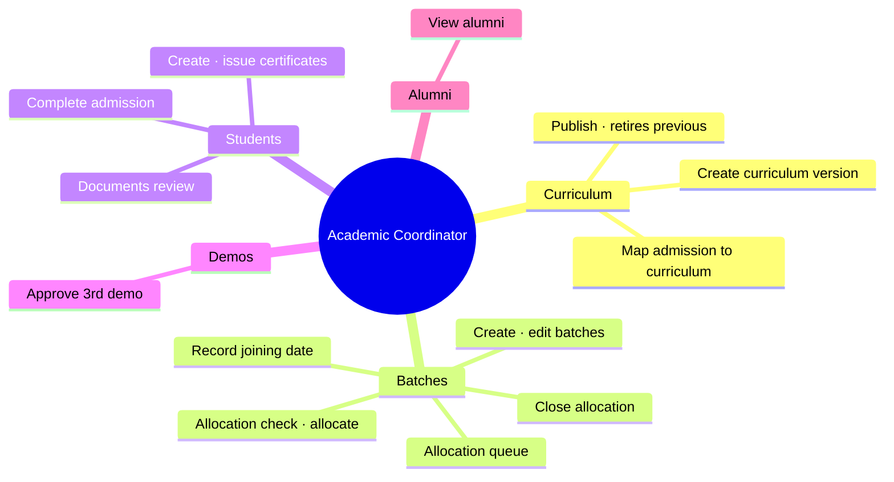

**Rules**
- Curriculum mapping is limited to Academic Coordinators **at the student's service branch**, plus admins. Branch Managers can allocate batches but **cannot map curricula**.
- Allocation deadlines: Confirmed Seat within **1 working day** and before the first class; Future Plan **48 hours** before start; alert **24 hours** before a batch starts if anyone is unallocated.

### 4.5 Trainer

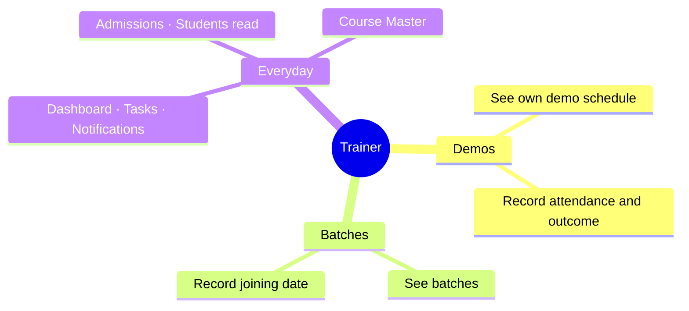

Outcome can be recorded only **after the demo's start time** and only while the demo is Scheduled or Confirmed.

### 4.6 Placement Team

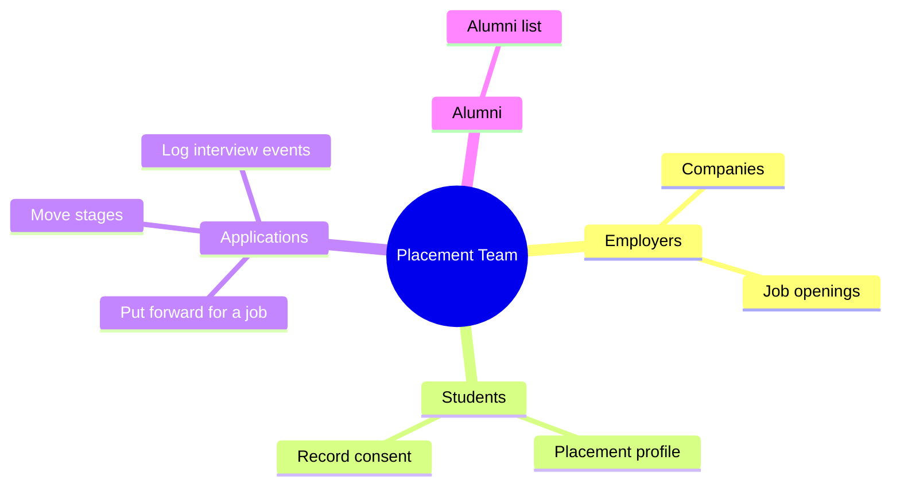

A student can be put forward **only with explicit consent** and only for an **open** job. Branch Managers and admins share these screens.

### 4.7 HR

Read-side staff access: Dashboard, Admissions, Students (Student 360, documents, support cases), Tasks, Course Master, Notifications. No leads, money or academics actions.

### 4.8 Founder / CEO and Super Admin

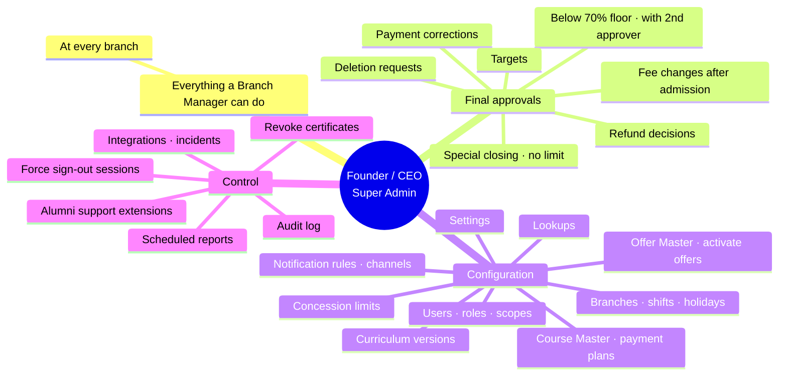

Founder / CEO and Super Admin have the same permissions, with one difference: **only a Founder / CEO can grant Founder / CEO access** or create a recovery account. Admins cannot change their own access, deactivate or reset themselves.

---

## 5. Approvals and the two-person rule

Nobody approves their own request. This is enforced for discounts, payment corrections, fee changes, documents, deletion requests and refunds (decide vs payout).

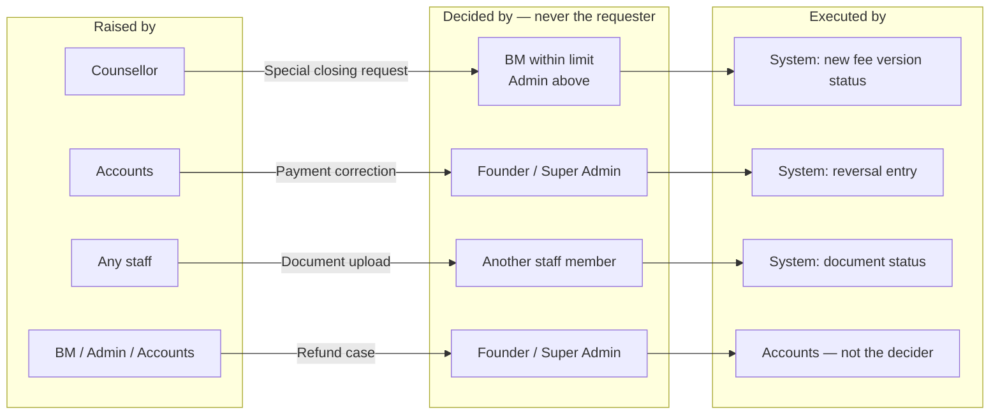

### 5.1 Special closing (extra concession)

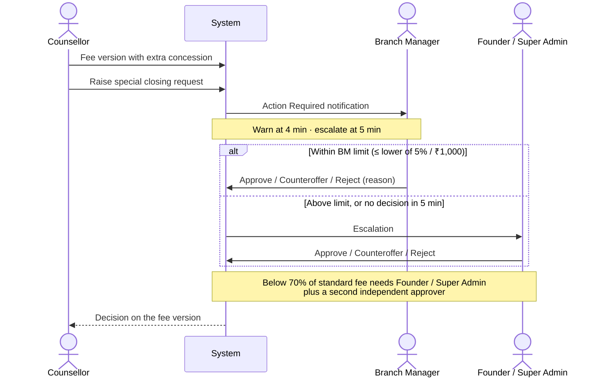

### 5.2 Payment verification and correction

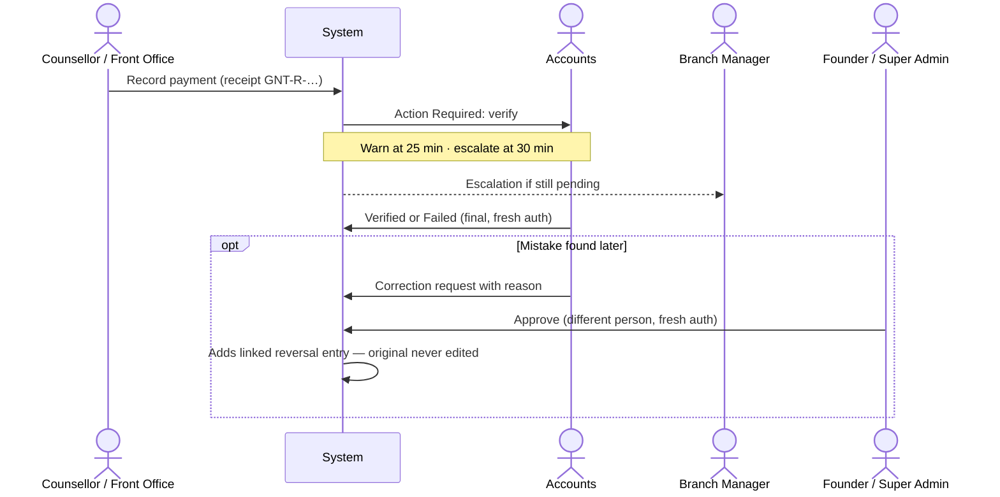

### 5.3 Fee change after admission

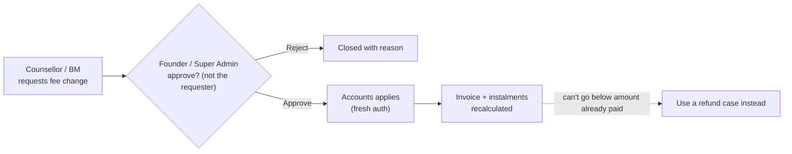

### 5.4 Refund case

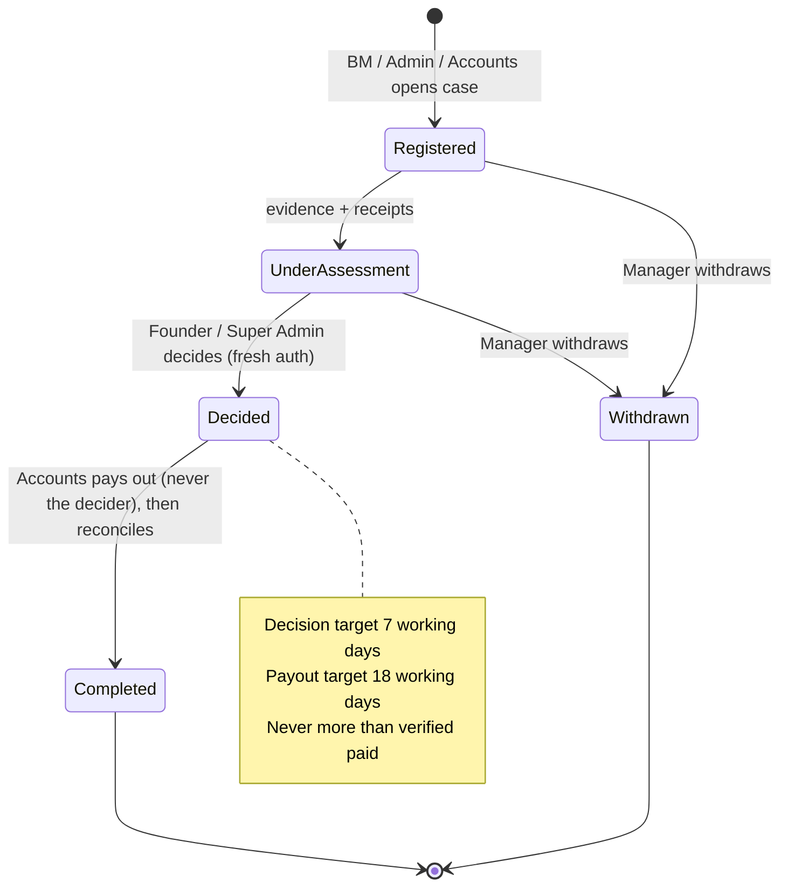

### 5.5 Other approvals

| What | Requested by | Approved by | Notes |
|---|---|---|---|
| 3rd demo (after 2 attended) | Counsellor | Academic Coordinator or BM | Setting `demo_max_attended` = 2 |
| Fee version | Counsellor | **Counsellor or BM** if no extra concession and at / above floor (offers count as pre-approved); otherwise only via an approved special closing request | Must be Approved before accept plan / invoice |
| Offer activation | Admin | Admin (fresh auth) | Needs approver + dates; activating deactivates the other active version of the same code. The creator can activate their own offer today |
| Target version | Admin drafts | Admin (fresh auth) | Approved version supersedes the overlapping one |
| Deletion request | Admin | A *different* Admin (fresh auth), then execute | |
| Document | Any staff uploads | A different staff member reviews | Verify / reject with reason |
| Certificate revoke | — | Admin (fresh auth) | Reason required |
| Alumni support extension | — | Admin (fresh auth) | Default 6 months |

---

## 6. Fresh authentication

Sensitive actions ask for the password again if the last login is older than **15 minutes** (`fresh_auth_minutes`).

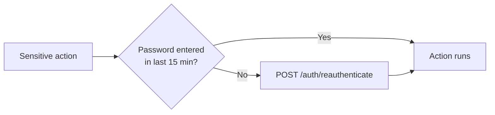

Actions that need it:

| Area | Actions |
|---|---|
| Users | Create user · reset password · add / remove scopes · force sign-out a session |
| Configuration | Settings · concession limits · offer activate / deactivate |
| Money | Approve special closing · verify / fail payment · approve correction · approve / apply fee change · decide refund |
| Academics | Revoke certificate · alumni support extension |
| Management | Approve targets · approve / execute deletion requests |

---

## 7. Every setting, and who controls it

All configuration lives in **More → Admin / Settings** (Founder / CEO and Super Admin only), except Course Master, Offer Master, Target Master and Curriculum, which have their own screens.

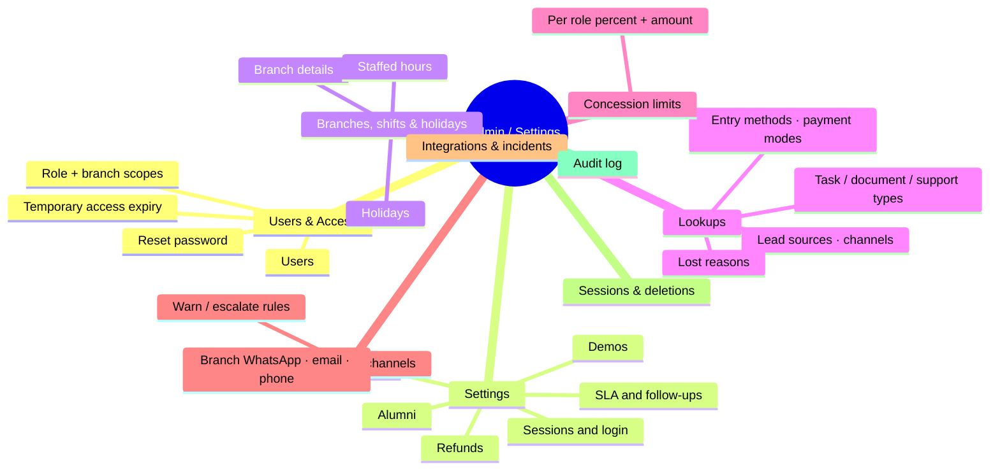

### 7.1 System settings (`app_settings`, Admin / Settings → Settings)

| Setting | Current value | What it controls | Roles affected |
|---|---|---|---|
| `session_idle_minutes` | 30 | Sign-out after inactivity | Everyone |
| `session_max_hours` | 12 | Maximum session length | Everyone |
| `login_max_attempts` | 5 | Failed logins before lock | Everyone |
| `login_lock_minutes` | 15 | How long a lock lasts | Everyone |
| `password_min_length` | 10 | Minimum password length | Everyone |
| `fresh_auth_minutes` | 15 | Window for sensitive actions (§6) | Admins, Accounts, BM |
| `sla_at_risk_minutes` | 30 | When an item turns *At Risk* before its deadline | Counsellors, BM, Accounts |
| `commercial_follow_up_staffed_minutes` | 120 | Fee follow-up due after an attended / no-show demo | Counsellors, Trainer |
| `demo_max_attended` | 2 | Attended demos before approval is needed | Counsellors, Acad. Coord., BM |
| `refund_decision_target_working_days` | 7 | Refund decision target | Admins |
| `refund_payout_target_working_days` | 18 | Payout target after approval | Accounts |
| `alumni_support_months` | 6 | Support after course completion | Placement, Admins |
| `report_cutoff_time` | 20:00 | Daily report cutoff (IST) | Managers, Accounts |
| `business_timezone` | Asia/Kolkata | Staffed-time and report periods | Everyone |
| `admission_token_amount` | 1000 | Verified payments (₹) needed on the invoice before the admission can be created | Counsellors, Accounts |
| `installment_due_soon_days` | 2 | "Due soon" alert to the owner, Accounts and BM this many days before an instalment | Counsellors, Accounts, BM |
| `payment_gap_alert_days` | 30 | Alert (owner, Accounts, BM, admins) and dashboard "Long-gap plans" when the next instalment is due this long after a verified payment | Counsellors, Accounts, BM, Admins |

### 7.2 Concession limits (Admin / Settings → Concession limits)

Extra concession a role may approve on its own: the **lower** of percent and amount; both blank = unlimited.

| Role | Max % | Max ₹ | Effect |
|---|---|---|---|
| Branch Manager | 5% | ₹1,000 | Above this, the request goes to an admin |
| Founder / CEO | — | — | Unlimited |
| Super Admin | — | — | Unlimited |

Separate hard rule (not a setting): below **70% of the standard fee** needs Founder / Super Admin **plus a second independent approver**.

### 7.3 Notification and escalation rules (Admin / Settings → Notifications & channels)

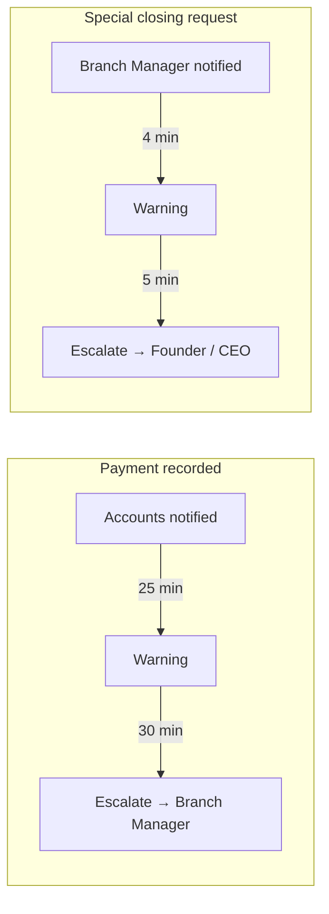

| Rule | Event | Recipient | Warn | Escalate | Escalate to |
|---|---|---|---|---|---|
| `PAYMENT_PENDING_VERIFICATION` | payment.recorded | Accounts | 25 min | 30 min | Branch Manager |
| `SCR_PENDING` | scr.created | Branch Manager | 4 min | 5 min | Founder / CEO |

Minutes are **staffed minutes** — they only run during branch hours (§7.4). Branch channels (WhatsApp numbers, email senders, phone lines) are configured per branch on the same tab; nothing is sent externally until integrations are live.

### 7.4 Branches, shifts and holidays

- **Staffed hours:** currently Monday–Saturday, 09:00–19:00 at both branches. Every SLA, escalation and "working day" uses these.
- **Holidays** are excluded from staffed time.
- Branch details (name, code, prefix) feed the codes on receipts and invoices (`GNT-R-…`, `INV-GNT-…`).

### 7.5 Lookups

Dropdown values used across the CRM: lead sources, contact channels, entry methods, payment modes, lost reasons, task types, document types, support case types. Admins add, rename and **deactivate** values; values are never deleted and codes never change, so old records stay readable.

### 7.6 Masters outside Admin / Settings

| Master | Screen | Edit | View |
|---|---|---|---|
| Courses, fees, branch availability, combo components | Course Master | Admins | All staff |
| Payment plans (Full · 2 instalments · 3 instalments) | Admin API | Admins | Lead roles |
| Offers (discount / complimentary course, scope, dates) | More → Offer Master | Admins | Admins, BM |
| Targets (collections, paid admissions per branch) | More → Target Master | Admins draft + approve | Admins, BM, Accounts |
| Curriculum versions | Batches → Curriculum | Acad. Coord., Admins | Managers, Acad. Coord., Trainer |

Rules that apply to all masters: an **active offer can't be edited** (make a new version); a **payment plan in use can't be changed** (make a new plan); **publishing a curriculum retires the previous version**.

---

## 8. Full action permission reference

Grouped by module. "Owner" = the lead's assigned counsellor. All of these are also branch-scoped unless the actor is an admin.

| Module | Action | Allowed roles |
|---|---|---|
| **Leads** | Create lead / person / enquiry, CSV import | Sales, Front Office, BM, Admins |
| | Edit, move stage, set follow-up, mark lost | Owner, BM, Admins (any branch counsellor while unassigned) |
| | Qualification checks, Mark Qualified, Convert to deal | Owner, BM, Admins (any branch counsellor while unassigned) |
| | Log follow-up | Owner, Front Office, BM, Admins |
| | Assign, bulk assign, reactivate | BM, Admins |
| | Log activity, saved views | All lead roles |
| **Pipeline** | Move a card, mark it lost, set its follow-up | Card owner, BM, Admins (any branch counsellor while unassigned) |
| | Change a card's owner | BM, Admins |
| | Set a card's expected close | Card owner, BM, Admins |
| **Persons** | List / search persons, Person 360 | All lead roles (own branches) |
| **Demos** | Book, edit, confirm, reschedule, cancel | Sales, Front Office, BM, Admins |
| | Record outcome | Trainer, Sales, Front Office, BM, Admins |
| | Approve 3rd demo | Academic Coordinator, BM |
| **Fees** | Open discussion | Counsellors, BM |
| | New version, share, raise special closing | Counsellors |
| **Delivery plan** | Save, accept, reopen (until invoiced) | Deal owner, counsellors, BM, Academic Coordinator, Admins |
| | Approve standard-price version (no extra concession) | Counsellors, BM, Admins |
| | Decide special closing (approves the version too) | BM (within limit), Admins |
| **Invoices** | Create (one or more compatible courses) | Counsellors, Accounts, BM |
| | Change instalment due date | Counsellors, Accounts |
| | Cancel (unpaid only) | Accounts, BM, Admins |
| **Payments** | Record | Sales, Front Office, Accounts |
| | Verify (with evidence / cash checks) / fail | Accounts, Admins |
| | Allocate advance | Accounts |
| | Request correction | Accounts, Admins |
| | Approve correction | Founder / CEO, Super Admin |
| **Admissions** | Created automatically on verification; manual fallback from the eligibility review | Sales, Front Office, BM, Accounts |
| | Complimentary course | Counsellors, BM |
| | Cancel, transfer | BM |
| | Request fee change | Counsellors, BM |
| | Approve / reject fee change | Admins |
| | Apply fee change | Accounts |
| **Academics** | Create / edit batch, allocation queue, allocate | Academic Coordinator, BM |
| | Close allocation, complete admission | Academic Coordinator |
| | Joining date | Academic Coordinator, Trainer |
| | Create / publish curriculum, map curriculum | Academic Coordinator, Admins |
| | Create / issue certificate | Academic Coordinator, Admins |
| | Revoke certificate | Admins |
| **Students** | View Student 360, upload / review documents, support cases | All staff |
| **Collections** | Dues, ageing, promises to pay | Lead roles + Accounts |
| **Refunds** | Open, view, edit | BM, Admins, Accounts |
| | Decide | Admins |
| | Payout, reconcile | Accounts only |
| | Withdraw | BM, Admins |
| **Tasks** | All task actions | All staff |
| **Communications** | Inbox, log, reply, retry, match | Lead roles |
| | Branch channels, notification rules | Admins |
| **Notifications** | Read / acknowledge / complete own | Everyone |
| **Placement** | Companies, jobs, profiles, consent, applications | Placement, BM, Admins |
| | Alumni list | Placement, BM, Admins, Academic Coordinator |
| | Support extension | Admins |
| **Reports** | Management, funnel, performance, SLA, export | BM, Admins, Accounts |
| | Scheduled reports | Admins |
| | Targets view / achievement | BM, Admins, Accounts |
| | Create / approve targets | Admins |
| **Dashboard** | Dashboard | All staff (role-aware content) |
| | Counsellor summary | Counsellors, BM, Admins |
| **AI** | Copilot, lead brief, next best action | Lead roles |
| | Ask Nipuna, management brief | BM, Admins |
| **Admin** | Users, scopes, settings, lookups, branches, holidays, concession limits, courses, payment plans, offers, integrations, incidents, audit log, sessions, deletion requests | Founder / CEO, Super Admin |

---

## 9. Known gaps

Things that behave differently from what the rules above might suggest. Tracked here until they are decided in [BACKLOG.md](BACKLOG.md).

- **Offer self-activation:** the admin who creates an offer can also activate it; the two-person rule doesn't cover offers.
- **Curriculum mapping at branches without an Academic Coordinator:** Branch Managers can allocate batches but can't map curricula, so only an admin can clear *Mapping Pending*.
- **Complimentary course list can include the main course:** an offer can list the student's own course as complimentary.
- **Counsellors adding a complimentary course** type the numeric offer ID, because they can't list offers.
- **Manual stage moves:** a deal can be moved to *Demo Attended* by hand without an attended demo; only backward moves after *Payment Pending Verification* are blocked.
- **Deal owner at conversion:** converting onto a person's existing card keeps that card's owner; the owner picked in the dialog applies to a new card only.
- **Verifier independence for cash:** the "independent cash check" is a tick recorded on the payment; the system doesn't yet require the verifier to be a different person from the collector.
